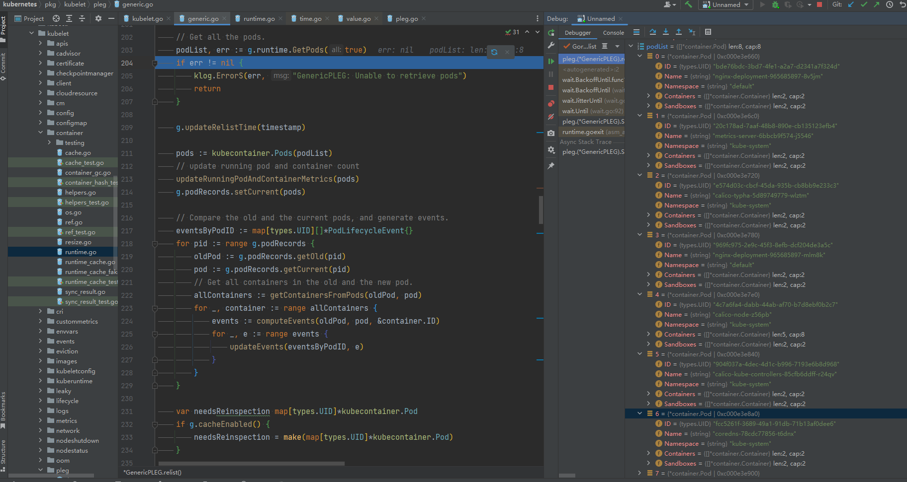

# 1. 环境说明
`Kubernetes`源码版本：`remotes/origin/release-1.25`
`Kubernetes`编译出来的`Kubelet`版本：`Kubernetes v1.24.0-beta.0.2463+ee7799bab469d7`
`Kubernetes`集群实验环境：使用`Kubernetes v1.25.4`二进制的方式搭建了一个单节点集群
> K8S 单节点单节点搭建可以参考：[Kubernetes v1.25 搭建单节点集群用于Debug K8S源码](https://blog.csdn.net/IOT_AI/article/details/128191974)

`Golang`版本：`go1.19.3 linux/amd64`
`IDEA`版本：`2022.2.3`
`Delve`版本：`1.9.1`

```sh
[root@k8s-master1 kubernetes]#
[root@k8s-master1 kubernetes]# dlv version
Delve Debugger
Version: 1.9.1
Build: $Id: d81b9fd12bfa603f3cf7a4bc842398bd61c42940 $
[root@k8s-master1 kubernetes]#
[root@k8s-master1 kubernetes]# go version
go version go1.19.3 linux/amd64
[root@k8s-master1 kubernetes]#
[root@k8s-master1 kubernetes]# kubectl version
WARNING: This version information is deprecated and will be replaced with the output from kubectl version --short.  Use --output=yaml|json to get the full version.
Client Version: version.Info{Major:"1", Minor:"25", GitVersion:"v1.25.4", GitCommit:"872a965c6c6526caa949f0c6ac028ef7aff3fb78", GitTreeState:"clean", BuildDate:"2022-11-09T13:36:36Z", GoVersion:"go1.19.3", Compiler:"gc", Platform:"linux/amd64"}
Kustomize Version: v4.5.7
Server Version: version.Info{Major:"1", Minor:"25", GitVersion:"v1.25.4", GitCommit:"872a965c6c6526caa949f0c6ac028ef7aff3fb78", GitTreeState:"clean", BuildDate:"2022-11-09T13:29:58Z", GoVersion:"go1.19.3", Compiler:"gc", Platform:"linux/amd64"}
[root@k8s-master1 kubernetes]#
[root@k8s-master1 kubernetes]#
[root@k8s-master1 kubernetes]# kubectl get nodes -owide
NAME          STATUS   ROLES    AGE   VERSION   INTERNAL-IP     EXTERNAL-IP   OS-IMAGE                KERNEL-VERSION                CONTAINER-RUNTIME
k8s-master1   Ready    <none>   31h   v1.25.4   192.168.11.71   <none>        CentOS Linux 7 (Core)   3.10.0-1160.80.1.el7.x86_64   containerd://1.6.10
[root@k8s-master1 kubernetes]#
[root@k8s-master1 kubernetes]#
[root@k8s-master1 kubernetes]# kubectl get componentstatus
Warning: v1 ComponentStatus is deprecated in v1.19+
NAME                 STATUS    MESSAGE                         ERROR
etcd-0               Healthy   {"health":"true","reason":""}
controller-manager   Healthy   ok
scheduler            Healthy   ok
[root@k8s-master1 kubernetes]#
```
`Kubelet`启动参数配置如下：
```sh
[root@k8s-master1 kubernetes]# ps -ef|grep "/usr/local/bin/kubelet"
root       7972      1  6 07:06 ?        00:00:06 /usr/local/bin/kubelet --bootstrap-kubeconfig=/etc/kubernetes/bootstrap-kubelet.kubeconfig --kubeconfig=/etc/kubernetes/kubelet.kubeconfig --config=/etc/kubernetes/kubelet-conf.yml --container-runtime-endpoint=unix:///run/containerd/containerd.sock --node-labels=node.kubernetes.io/node= --v=8
root       9549   6424  0 07:07 pts/0    00:00:00 grep --color=auto /usr/local/bin/kubelet
[root@k8s-master1 kubernetes]#
```
`Kubelet`参数配置如下：

```yaml
apiVersion: kubelet.config.k8s.io/v1beta1
kind: KubeletConfiguration
address: 0.0.0.0
port: 10250
readOnlyPort: 10255
authentication:
  anonymous:
    enabled: false
  webhook:
    cacheTTL: 2m0s
    enabled: true
  x509:
    clientCAFile: /etc/kubernetes/pki/ca.pem
authorization:
  mode: Webhook
  webhook:
    cacheAuthorizedTTL: 5m0s
    cacheUnauthorizedTTL: 30s
cgroupDriver: systemd
cgroupsPerQOS: true
clusterDNS:
- 10.96.0.10
clusterDomain: cluster.local
containerLogMaxFiles: 5
containerLogMaxSize: 10Mi
contentType: application/vnd.kubernetes.protobuf
cpuCFSQuota: true
cpuManagerPolicy: none
cpuManagerReconcilePeriod: 10s
enableControllerAttachDetach: true
enableDebuggingHandlers: true
enforceNodeAllocatable:
- pods
eventBurst: 10
eventRecordQPS: 5
evictionHard:
  imagefs.available: 15%
  memory.available: 100Mi
  nodefs.available: 10%
  nodefs.inodesFree: 5%
evictionPressureTransitionPeriod: 5m0s
failSwapOn: true
fileCheckFrequency: 20s
hairpinMode: promiscuous-bridge
healthzBindAddress: 127.0.0.1
healthzPort: 10248
httpCheckFrequency: 20s
imageGCHighThresholdPercent: 85
imageGCLowThresholdPercent: 80
imageMinimumGCAge: 2m0s
iptablesDropBit: 15
iptablesMasqueradeBit: 14
kubeAPIBurst: 10
kubeAPIQPS: 5
makeIPTablesUtilChains: true
maxOpenFiles: 1000000
maxPods: 110
nodeStatusUpdateFrequency: 10s
oomScoreAdj: -999
podPidsLimit: -1
registryBurst: 10
registryPullQPS: 5
resolvConf: /etc/resolv.conf
rotateCertificates: true
runtimeRequestTimeout: 2m0s
serializeImagePulls: true
staticPodPath: /etc/kubernetes/manifests
streamingConnectionIdleTimeout: 4h0m0s
syncFrequency: 1m0s
volumeStatsAggPeriod: 1m0s
```

# 2. 源码分析

当执行到`startKubelet`函数时，函数末尾启动了`PLEG`，并且最后在`syncLoop`一直循环，我们一起来看看这两部分主要干了啥

```go
// Run starts the kubelet reacting to config updates
func (kl *Kubelet) Run(updates <-chan kubetypes.PodUpdate) {
	if kl.logServer == nil {
		kl.logServer = http.StripPrefix("/logs/", http.FileServer(http.Dir("/var/log/")))
	}
	if kl.kubeClient == nil {
		klog.InfoS("No API server defined - no node status update will be sent")
	}

	// Start the cloud provider sync manager
	if kl.cloudResourceSyncManager != nil {
		go kl.cloudResourceSyncManager.Run(wait.NeverStop)
	}

	if err := kl.initializeModules(); err != nil {
		kl.recorder.Eventf(kl.nodeRef, v1.EventTypeWarning, events.KubeletSetupFailed, err.Error())
		klog.ErrorS(err, "Failed to initialize internal modules")
		os.Exit(1)
	}

	// Start volume manager
	go kl.volumeManager.Run(kl.sourcesReady, wait.NeverStop)

	if kl.kubeClient != nil {
		// Introduce some small jittering to ensure that over time the requests won't start
		// accumulating at approximately the same time from the set of nodes due to priority and
		// fairness effect.
		go wait.JitterUntil(kl.syncNodeStatus, kl.nodeStatusUpdateFrequency, 0.04, true, wait.NeverStop)
		go kl.fastStatusUpdateOnce()

		// start syncing lease
		go kl.nodeLeaseController.Run(wait.NeverStop)
	}
	go wait.Until(kl.updateRuntimeUp, 5*time.Second, wait.NeverStop)

	// Set up iptables util rules
	if kl.makeIPTablesUtilChains {
		kl.initNetworkUtil()
	}

	// Start component sync loops.
	kl.statusManager.Start()

	// Start syncing RuntimeClasses if enabled.
	if kl.runtimeClassManager != nil {
		kl.runtimeClassManager.Start(wait.NeverStop)
	}

	// Start the pod lifecycle event generator.
	kl.pleg.Start()
	kl.syncLoop(updates, kl)
}
```

## 2.1. PLEG (Pod Lifecycle Event Generator)

<table><tr><td bgcolor=darkorange align=left><font size=5 color=white>PLEG (Pod Lifecycle Event Generator)</font></td></tr></table>

先来看看`PLEG`的接口定义，如下：
```go
// pkg/kubelet/pleg/pleg.go

type PodLifecycleEventGenerator interface {
    // 显然，Start执行后，PLEG主体逻辑就是在这里处理的
	Start()
	// 监听Pod生命周期事件，那么Pod的生命周期有哪些事件？
	Watch() chan *PodLifecycleEvent
	// 这个显然时用来监测`PLEG`的健康状况的
	Healthy() (bool, error)
}
```

如下所示，`Pod`的生命周期事件有开始、死亡、已被移除、同步以及容器发生改变，这里面最难理解的就是`PodSync`，目前我也不知道这个状态代表着什么，从名字上来看，应该是和`Pod`的同步操作有关，那么是谁和`Pod`之间的同步呢？
另外，这里的`ContainerChanged`状态，从名字上来看是容器发生改变后的状态，而注释上来看确是值的容器处于一个`unknown`状态。先不管，我们继续往下看，也许慢慢就理解了

```go
// pkg/kubelet/pleg/pleg.go

const (
	// ContainerStarted - event type when the new state of container is running.
	ContainerStarted PodLifeCycleEventType = "ContainerStarted"
	// ContainerDied - event type when the new state of container is exited.
	ContainerDied PodLifeCycleEventType = "ContainerDied"
	// ContainerRemoved - event type when the old state of container is exited.
	ContainerRemoved PodLifeCycleEventType = "ContainerRemoved"
	// PodSync is used to trigger syncing of a pod when the observed change of
	// the state of the pod cannot be captured by any single event above.
	PodSync PodLifeCycleEventType = "PodSync"
	// ContainerChanged - event type when the new state of container is unknown.
	ContainerChanged PodLifeCycleEventType = "ContainerChanged"
)
```

`PLEG`的具体实现为`GenericPLEG`，`Start`中并不难，直接起了一个协程，执行了`GenericPLEG.relist`。通过后面的分析可以知道，`GenericPLEG.relist()`函数并不是一个死循环，更新一遍`Pod`的状态就结束了。但是外层的`wait.Until`却不会放过`GenericPLEG.relist()`，它会每隔`relistPeriod`的时间执行一遍`GenericPLEG.relist()`
```go
// pkg/kubelet/pleg/generic.go

// Start spawns a goroutine to relist periodically.
func (g *GenericPLEG) Start() {
	go wait.Until(g.relist, g.relistPeriod, wait.NeverStop)
}
```

<table><tr><td bgcolor=darkorange align=left><font size=5 color=white>(g *GenericPLEG) relist()</font></td></tr></table>

具体逻辑如下：

- 1、通过`Runtime`获取所有的`Pod`，当前集群中的`Runtime`为`ContainerD`，从`debug`的信息上来看，获取到的`Pod`恰好就是当前的单节点集群中启动的`8`个`Pod`
- 2、记录重新同步的最后一次时间
- 3、在`PodRecord`中保存当前的`Pod`，`PodRecord`实际上就是一个`Map`，`key`为`Pod`的`ID`，而`Value`为一个接口体，这个结构体中就两个元素，一个为上一次`relist`查出来的`Pod`，一个为当前查出来的`Pod`，具体逻辑可以看`2.1.2. podRecords`。实际上，这也不难理解，`Pod`的状态只有通过两个时间点比对才能得出结论
- 4、

```go
// relist queries the container runtime for list of pods/containers, compare
// with the internal pods/containers, and generates events accordingly.
func (g *GenericPLEG) relist() {
	klog.V(5).InfoS("GenericPLEG: Relisting")

    // 记录指标，将来可以在普罗米修斯当中展示
	if lastRelistTime := g.getRelistTime(); !lastRelistTime.IsZero() {
		metrics.PLEGRelistInterval.Observe(metrics.SinceInSeconds(lastRelistTime))
	}

	timestamp := g.clock.Now()
	defer func() {
		metrics.PLEGRelistDuration.Observe(metrics.SinceInSeconds(timestamp))
	}()

	// Get all the pods. 获取所有Pod
	podList, err := g.runtime.GetPods(true)
	if err != nil {
		klog.ErrorS(err, "GenericPLEG: Unable to retrieve pods")
		return
	}

	g.updateRelistTime(timestamp)

    // 强制转换
	pods := kubecontainer.Pods(podList)
	// update running pod and container count 更新指标
	updateRunningPodAndContainerMetrics(pods)
	// 保存当前的`Pod`
	g.podRecords.setCurrent(pods)

	// Compare the old and the current pods, and generate events.
	// 一个Pod,内部有多个容器，每一个容器可能产生事件，因此这里是一个数组
	eventsByPodID := map[types.UID][]*PodLifecycleEvent{}
	for pid := range g.podRecords {
	    // 实际上这里的OldPod就是上一次执行relist保存的Pod
		oldPod := g.podRecords.getOld(pid)
		// 当前的Pod
		pod := g.podRecords.getCurrent(pid)
		// Get all containers in the old and the new pod.
		allContainers := getContainersFromPods(oldPod, pod)
		for _, container := range allContainers {
		    // 通过前后两个时间点的状态对比，计算出Pod的事件
			events := computeEvents(oldPod, pod, &container.ID)
			for _, e := range events {
				updateEvents(eventsByPodID, e)
			}
		}
	}

	var needsReinspection map[types.UID]*kubecontainer.Pod
	if g.cacheEnabled() {
		needsReinspection = make(map[types.UID]*kubecontainer.Pod)
	}

	// If there are events associated with a pod, we should update the
	// podCache.
	for pid, events := range eventsByPodID {
		pod := g.podRecords.getCurrent(pid)
		if g.cacheEnabled() {
			// updateCache() will inspect the pod and update the cache. If an
			// error occurs during the inspection, we want PLEG to retry again
			// in the next relist. To achieve this, we do not update the
			// associated podRecord of the pod, so that the change will be
			// detect again in the next relist.
			// TODO: If many pods changed during the same relist period,
			// inspecting the pod and getting the PodStatus to update the cache
			// serially may take a while. We should be aware of this and
			// parallelize if needed.
			if err := g.updateCache(pod, pid); err != nil {
				// Rely on updateCache calling GetPodStatus to log the actual error.
				klog.V(4).ErrorS(err, "PLEG: Ignoring events for pod", "pod", klog.KRef(pod.Namespace, pod.Name))

				// make sure we try to reinspect the pod during the next relisting
				needsReinspection[pid] = pod

				continue
			} else {
				// this pod was in the list to reinspect and we did so because it had events, so remove it
				// from the list (we don't want the reinspection code below to inspect it a second time in
				// this relist execution)
				delete(g.podsToReinspect, pid)
			}
		}
		// Update the internal storage and send out the events.
		g.podRecords.update(pid)

		// Map from containerId to exit code; used as a temporary cache for lookup
		containerExitCode := make(map[string]int)

		for i := range events {
			// Filter out events that are not reliable and no other components use yet.
			if events[i].Type == ContainerChanged {
				continue
			}
			select {
			case g.eventChannel <- events[i]:
			default:
				metrics.PLEGDiscardEvents.Inc()
				klog.ErrorS(nil, "Event channel is full, discard this relist() cycle event")
			}
			// Log exit code of containers when they finished in a particular event
			if events[i].Type == ContainerDied {
				// Fill up containerExitCode map for ContainerDied event when first time appeared
				if len(containerExitCode) == 0 && pod != nil && g.cache != nil {
					// Get updated podStatus
					status, err := g.cache.Get(pod.ID)
					if err == nil {
						for _, containerStatus := range status.ContainerStatuses {
							containerExitCode[containerStatus.ID.ID] = containerStatus.ExitCode
						}
					}
				}
				if containerID, ok := events[i].Data.(string); ok {
					if exitCode, ok := containerExitCode[containerID]; ok && pod != nil {
						klog.V(2).InfoS("Generic (PLEG): container finished", "podID", pod.ID, "containerID", containerID, "exitCode", exitCode)
					}
				}
			}
		}
	}

	if g.cacheEnabled() {
		// reinspect any pods that failed inspection during the previous relist
		if len(g.podsToReinspect) > 0 {
			klog.V(5).InfoS("GenericPLEG: Reinspecting pods that previously failed inspection")
			for pid, pod := range g.podsToReinspect {
				if err := g.updateCache(pod, pid); err != nil {
					// Rely on updateCache calling GetPodStatus to log the actual error.
					klog.V(5).ErrorS(err, "PLEG: pod failed reinspection", "pod", klog.KRef(pod.Namespace, pod.Name))
					needsReinspection[pid] = pod
				}
			}
		}

		// Update the cache timestamp.  This needs to happen *after*
		// all pods have been properly updated in the cache.
		g.cache.UpdateTime(timestamp)
	}

	// make sure we retain the list of pods that need reinspecting the next time relist is called
	g.podsToReinspect = needsReinspection
}
```

```shell
[root@k8s-master1 ~]# kubectl get pods -A
NAMESPACE     NAME                                       READY   STATUS    RESTARTS      AGE
default       nginx-deployment-965685897-8v5jm           1/1     Running   4 (81m ago)   46h
default       nginx-deployment-965685897-mlm8k           1/1     Running   4 (81m ago)   46h
default       nginx-deployment-965685897-z59bk           1/1     Running   4 (81m ago)   46h
kube-system   calico-kube-controllers-85cfb6ddff-r24qv   1/1     Running   5 (81m ago)   46h
kube-system   calico-node-z56pb                          1/1     Running   4 (81m ago)   46h
kube-system   calico-typha-5d89749779-wlztm              1/1     Running   4 (81m ago)   46h
kube-system   coredns-78cdc77856-t6dnx                   1/1     Running   4 (81m ago)   46h
kube-system   metrics-server-6bbcb9f574-j5546            1/1     Running   8 (81m ago)   46h
[root@k8s-master1 ~]#
[root@k8s-master1 ~]#
```




### 2.1.1. runtime.GetPods

<table><tr><td bgcolor=darkorange align=left><font size=5 color=white>runtime.GetPods</font></td></tr></table>

### 2.1.2. podRecords

<table><tr><td bgcolor=darkorange align=left><font size=5 color=white>getContainersFromPods</font></td></tr></table>

如下所示，`PodRecord`结构并不难理解，实际上回想起刚才看见的`PodLifecycleEvent`就更不难理解了，`PodLifecycleEvent`中有`ContainerStarted，ContainerDied, ContainerRemoved, PodSync, ContainerChanged`这五种状态，而`Pod`中又不可能记录自己的状态，因为状态一定是对比出来的，尤其是前三个。所以，要想获取`Pod`的状态，我们只需要记录两个时刻的`Pod`，然后对比一下，就知道`Pod`的实际状态了。
```go
// pkg/kubelet/pleg/generic.go

type podRecord struct {
	old     *kubecontainer.Pod
	current *kubecontainer.Pod
}

type podRecords map[types.UID]*podRecord
```

```go
unc (pr podRecords) getOld(id types.UID) *kubecontainer.Pod {
	r, ok := pr[id]
	if !ok {
		return nil
	}
	return r.old
}

func (pr podRecords) getCurrent(id types.UID) *kubecontainer.Pod {
	r, ok := pr[id]
	if !ok {
		return nil
	}
	return r.current
}

// 把当前获取Pod全部设置为current
func (pr podRecords) setCurrent(pods []*kubecontainer.Pod) {
	for i := range pr {
	    // 必须要提前把所有的current清空，因为Pod被删除之后就没了，通过对比，就能得出`Pod`已经被删除这个状态
		pr[i].current = nil
	}
	for _, pod := range pods {
		if r, ok := pr[pod.ID]; ok {
		    // 上一次relist的时候，pod就存在
			r.current = pod
		} else {
		    // 说明是新建的pod
			pr[pod.ID] = &podRecord{current: pod}
		}
	}
}

func (pr podRecords) update(id types.UID) {
	r, ok := pr[id]
	if !ok {
		return
	}
	pr.updateInternal(id, r)
}


func (pr podRecords) updateInternal(id types.UID, r *podRecord) {
	if r.current == nil {
		// Pod no longer exists; delete the entry.
		// 这一步非常重要，不删除记录的话，会存在内存溢出的情况
		delete(pr, id)
		return
	}
	r.old = r.current
	r.current = nil
}


func getContainersFromPods(pods ...*kubecontainer.Pod) []*kubecontainer.Container {
    // 保存所有pod的containerId，这里主要是为了防止重复
	cidSet := sets.NewString()
	var containers []*kubecontainer.Container
	// 该匿名函数的作用就是保存传入进来的所有容器的ID
	fillCidSet := func(cs []*kubecontainer.Container) {
		for _, c := range cs {
			cid := c.ID.ID
			// 如果已经保存过，就跳过
			if cidSet.Has(cid) {
				continue
			}
			// 否则保存起来
			cidSet.Insert(cid)
			// 核心还是为了收集Pod中所有的容器
			containers = append(containers, c)
		}
	}

	for _, p := range pods {
		if p == nil {
			continue
		}
		// 遍历所有的Pod,然后把所有Pod的容器的ID收集起来
		fillCidSet(p.Containers)
		// Update sandboxes as containers
		// TODO: keep track of sandboxes explicitly.
		// conainer和sandbox有啥区别？
		fillCidSet(p.Sandboxes)
	}
	return containers
}
```

### 2.1.3. computeEvent

<table><tr><td bgcolor=darkorange align=left><font size=5 color=white>computeEvent</font></td></tr></table>

```go
// pkg/kubelet/pleg/generic.go

func computeEvents(oldPod, newPod *kubecontainer.Pod, cid *kubecontainer.ContainerID) []*PodLifecycleEvent {
	var pid types.UID
	if oldPod != nil {
		pid = oldPod.ID
	} else if newPod != nil {
		pid = newPod.ID
	}
	oldState := getContainerState(oldPod, cid)
	newState := getContainerState(newPod, cid)
	return generateEvents(pid, cid.ID, oldState, newState)
}
```

<table><tr><td bgcolor=darkorange align=left><font size=5 color=white>generateEvents</font></td></tr></table>

`generateEvents`顾名思义，就是生成`Pod`的事件，准确一点说就是生命周期事件。如前所述，`Pod`的事件是通过对两个事件点的对比得出结论的。只要前后两个时刻的状态一致，就直接返回，任何事件都不产生。若不一致，就产生对应事件

```go
// pkg/kubelet/pleg/generic.go

func generateEvents(podID types.UID, cid string, oldState, newState plegContainerState) []*PodLifecycleEvent {
	if newState == oldState {
		return nil
	}

	klog.V(4).InfoS("GenericPLEG", "podUID", podID, "containerID", cid, "oldState", oldState, "newState", newState)
	switch newState {
	case plegContainerRunning:
		return []*PodLifecycleEvent{{ID: podID, Type: ContainerStarted, Data: cid}}
	case plegContainerExited:
		return []*PodLifecycleEvent{{ID: podID, Type: ContainerDied, Data: cid}}
	case plegContainerUnknown:
		return []*PodLifecycleEvent{{ID: podID, Type: ContainerChanged, Data: cid}}
	case plegContainerNonExistent:
		switch oldState {
		case plegContainerExited:
			// We already reported that the container died before.
			return []*PodLifecycleEvent{{ID: podID, Type: ContainerRemoved, Data: cid}}
		default:
			return []*PodLifecycleEvent{{ID: podID, Type: ContainerDied, Data: cid}, {ID: podID, Type: ContainerRemoved, Data: cid}}
		}
	default:
		panic(fmt.Sprintf("unrecognized container state: %v", newState))
	}
}
```


<table><tr><td bgcolor=darkorange align=left><font size=5 color=white>getContainerState</font></td></tr></table>

具体逻辑很简单：

- 1、默认容器的状态不存在，如果当前`Pod`不存在，就直接认为那个时刻容器不存在，非常合情合理。
    - 实际上，这里的容器不存在，可能有两种情况，一种是`Pod`刚被创建，`kubelet`还没有来得及创建容器。另外一种就是`Pod`被删除了
- 2、通过容器的`ID`在`Pod`中查询容器，并把返回容器的对应状态
- 3、如果在`Pod`中未找到`Continer`，那么查询`Pod`的`Sandbox`，如果找到了，那么返回容器状态
    - <font size=4 color=Red>**那么`container`和`sandbox`具体有啥区别呢？这个估计需要看`contaienrd`的底层设计了**</font>
- 4、如果都没有找到，则直接返回默认的容器状态。
    - <font size=4 color=Red>**什么情况下，前后两个时间点的`Pod`都没有查询到，但是能查到容器呢？**</font>

```go
// pkg/kubelet/pleg/generic.go

func getContainerState(pod *kubecontainer.Pod, cid *kubecontainer.ContainerID) plegContainerState {
	// Default to the non-existent state.
	// 默认认为容器不存在，实际上不存在可能有两种情况，第一种是容器刚创建，所以还不存在，第二种是容器被删除
	state := plegContainerNonExistent
	if pod == nil {
	    // ContainerD还没有创建该Pod,直接返回默认状态
		return state
	}
	// 通过容器的ID查询容器
	c := pod.FindContainerByID(*cid)
	if c != nil {
	    // 把容器的状态转换为PLEG的可识别的状态
		return convertState(c.State)
	}

    // 如果在Container中没有找到容器，那么就在Sandbox中找
	c = pod.FindSandboxByID(*cid)
	if c != nil {
		return convertState(c.State)
	}

	return state
}
```

<table><tr><td bgcolor=darkorange align=left><font size=5 color=white>convertState</font></td></tr></table>

`convertState`函数仅仅是为了做映射，把容器的状态映射到`PLEG`的状态

```go
// pkg/kubelet/pleg/generic.go

func convertState(state kubecontainer.State) plegContainerState {
	switch state {
	case kubecontainer.ContainerStateCreated:
		// kubelet doesn't use the "created" state yet, hence convert it to "unknown".
		return plegContainerUnknown
	case kubecontainer.ContainerStateRunning:
		return plegContainerRunning
	case kubecontainer.ContainerStateExited:
		return plegContainerExited
	case kubecontainer.ContainerStateUnknown:
		return plegContainerUnknown
	default:
		panic(fmt.Sprintf("unrecognized container state: %v", state))
	}
}
```

## 2.2. syncLoop

<table><tr><td bgcolor=darkorange align=left><font size=5 color=white>syncLoop</font></td></tr></table>
