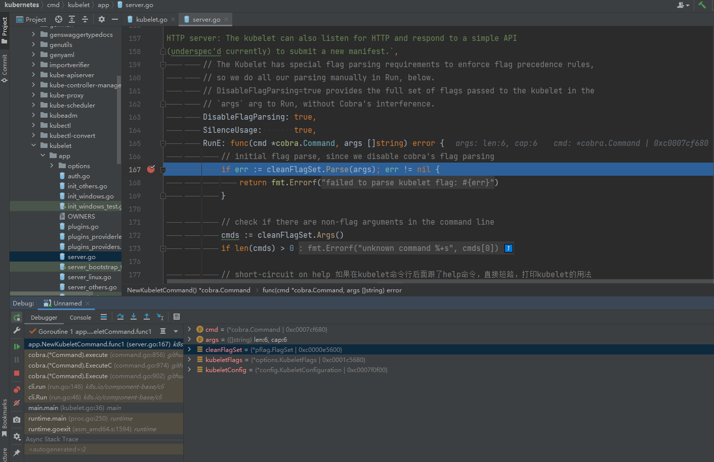

# 1. 环境说明
`Kubernetes`源码版本：`remotes/origin/release-1.25`
`Kubernetes`编译出来的`Kubelet`版本：`Kubernetes v1.24.0-beta.0.2463+ee7799bab469d7`
`Kubernetes`集群实验环境：使用`Kubernetes v1.25.4`二进制的方式搭建了一个单节点集群
> K8S 单节点单节点搭建可以参考：[Kubernetes v1.25 搭建单节点集群用于Debug K8S源码](https://blog.csdn.net/IOT_AI/article/details/128191974)

`Golang`版本：`go1.19.3 linux/amd64`
`IDEA`版本：`2022.2.3`
`Delve`版本：`1.9.1`

```sh
[root@k8s-master1 kubernetes]#
[root@k8s-master1 kubernetes]# dlv version
Delve Debugger
Version: 1.9.1
Build: $Id: d81b9fd12bfa603f3cf7a4bc842398bd61c42940 $
[root@k8s-master1 kubernetes]#
[root@k8s-master1 kubernetes]# go version
go version go1.19.3 linux/amd64
[root@k8s-master1 kubernetes]#
[root@k8s-master1 kubernetes]# kubectl version
WARNING: This version information is deprecated and will be replaced with the output from kubectl version --short.  Use --output=yaml|json to get the full version.
Client Version: version.Info{Major:"1", Minor:"25", GitVersion:"v1.25.4", GitCommit:"872a965c6c6526caa949f0c6ac028ef7aff3fb78", GitTreeState:"clean", BuildDate:"2022-11-09T13:36:36Z", GoVersion:"go1.19.3", Compiler:"gc", Platform:"linux/amd64"}
Kustomize Version: v4.5.7
Server Version: version.Info{Major:"1", Minor:"25", GitVersion:"v1.25.4", GitCommit:"872a965c6c6526caa949f0c6ac028ef7aff3fb78", GitTreeState:"clean", BuildDate:"2022-11-09T13:29:58Z", GoVersion:"go1.19.3", Compiler:"gc", Platform:"linux/amd64"}
[root@k8s-master1 kubernetes]#
[root@k8s-master1 kubernetes]#
[root@k8s-master1 kubernetes]# kubectl get nodes -owide
NAME          STATUS   ROLES    AGE   VERSION   INTERNAL-IP     EXTERNAL-IP   OS-IMAGE                KERNEL-VERSION                CONTAINER-RUNTIME
k8s-master1   Ready    <none>   31h   v1.25.4   192.168.11.71   <none>        CentOS Linux 7 (Core)   3.10.0-1160.80.1.el7.x86_64   containerd://1.6.10
[root@k8s-master1 kubernetes]#
[root@k8s-master1 kubernetes]#
[root@k8s-master1 kubernetes]# kubectl get componentstatus
Warning: v1 ComponentStatus is deprecated in v1.19+
NAME                 STATUS    MESSAGE                         ERROR
etcd-0               Healthy   {"health":"true","reason":""}
controller-manager   Healthy   ok
scheduler            Healthy   ok
[root@k8s-master1 kubernetes]#
```
`Kubelet`启动参数配置如下：
```sh
[root@k8s-master1 kubernetes]# ps -ef|grep "/usr/local/bin/kubelet"
root       7972      1  6 07:06 ?        00:00:06 /usr/local/bin/kubelet --bootstrap-kubeconfig=/etc/kubernetes/bootstrap-kubelet.kubeconfig --kubeconfig=/etc/kubernetes/kubelet.kubeconfig --config=/etc/kubernetes/kubelet-conf.yml --container-runtime-endpoint=unix:///run/containerd/containerd.sock --node-labels=node.kubernetes.io/node= --v=8
root       9549   6424  0 07:07 pts/0    00:00:00 grep --color=auto /usr/local/bin/kubelet
[root@k8s-master1 kubernetes]#
```
`Kubelet`参数配置如下：

```yaml
apiVersion: kubelet.config.k8s.io/v1beta1
kind: KubeletConfiguration
address: 0.0.0.0
port: 10250
readOnlyPort: 10255
authentication:
  anonymous:
    enabled: false
  webhook:
    cacheTTL: 2m0s
    enabled: true
  x509:
    clientCAFile: /etc/kubernetes/pki/ca.pem
authorization:
  mode: Webhook
  webhook:
    cacheAuthorizedTTL: 5m0s
    cacheUnauthorizedTTL: 30s
cgroupDriver: systemd
cgroupsPerQOS: true
clusterDNS:
- 10.96.0.10
clusterDomain: cluster.local
containerLogMaxFiles: 5
containerLogMaxSize: 10Mi
contentType: application/vnd.kubernetes.protobuf
cpuCFSQuota: true
cpuManagerPolicy: none
cpuManagerReconcilePeriod: 10s
enableControllerAttachDetach: true
enableDebuggingHandlers: true
enforceNodeAllocatable:
- pods
eventBurst: 10
eventRecordQPS: 5
evictionHard:
  imagefs.available: 15%
  memory.available: 100Mi
  nodefs.available: 10%
  nodefs.inodesFree: 5%
evictionPressureTransitionPeriod: 5m0s
failSwapOn: true
fileCheckFrequency: 20s
hairpinMode: promiscuous-bridge
healthzBindAddress: 127.0.0.1
healthzPort: 10248
httpCheckFrequency: 20s
imageGCHighThresholdPercent: 85
imageGCLowThresholdPercent: 80
imageMinimumGCAge: 2m0s
iptablesDropBit: 15
iptablesMasqueradeBit: 14
kubeAPIBurst: 10
kubeAPIQPS: 5
makeIPTablesUtilChains: true
maxOpenFiles: 1000000
maxPods: 110
nodeStatusUpdateFrequency: 10s
oomScoreAdj: -999
podPidsLimit: -1
registryBurst: 10
registryPullQPS: 5
resolvConf: /etc/resolv.conf
rotateCertificates: true
runtimeRequestTimeout: 2m0s
serializeImagePulls: true
staticPodPath: /etc/kubernetes/manifests
streamingConnectionIdleTimeout: 4h0m0s
syncFrequency: 1m0s
volumeStatsAggPeriod: 1m0s
```

# 2. 源码分析
## 2.1. main

<table><tr><td bgcolor=darkorangez align=left><font size=5 color=white>main</font></td></tr></table>

`kubelet`的启动入口如下，非常的简单明了，`kubernetes`中我们所熟知的组件入口点都是用`cobra`这个框架搭建的
```go
// cmd/kubelet/kubelet.go
func main() {
	command := app.NewKubeletCommand()
	code := cli.Run(command)
	os.Exit(code)
}
```

这里就是常规的`cobra`的用法，当我们启动`kubelet`之后，第一步就是进入到`RunE`当中。`RunE`基本都是在校验`kubelet`的启动参数，以及补全参数，重点就是调用了`Run(ctx, kubeletServer, kubeletDeps, utilfeature.DefaultFeatureGate)`
```go
// cmd/kubelet/app/server.go
func NewKubeletCommand() *cobra.Command {
	cleanFlagSet := pflag.NewFlagSet(componentKubelet, pflag.ContinueOnError)
	cleanFlagSet.SetNormalizeFunc(cliflag.WordSepNormalizeFunc)
	kubeletFlags := options.NewKubeletFlags()

	kubeletConfig, err := options.NewKubeletConfiguration()
	// programmer error
	if err != nil {
		klog.ErrorS(err, "Failed to create a new kubelet configuration")
		os.Exit(1)
	}

	cmd := &cobra.Command{
		Use: componentKubelet,
		Long: `xxxxxxx`,
		DisableFlagParsing: true,
		SilenceUsage:       true,
		RunE: func(cmd *cobra.Command, args []string) error {
			// initial flag parse, since we disable cobra's flag parsing
			if err := cleanFlagSet.Parse(args); err != nil {
				return fmt.Errorf("failed to parse kubelet flag: %w", err)
			}

			// check if there are non-flag arguments in the command line
			cmds := cleanFlagSet.Args()
			if len(cmds) > 0 {
				return fmt.Errorf("unknown command %+s", cmds[0])
			}

			// short-circuit on help
			help, err := cleanFlagSet.GetBool("help")
			if err != nil {
				return errors.New(`"help" flag is non-bool, programmer error, please correct`)
			}
			if help {
				return cmd.Help()
			}

			// short-circuit on verflag
			verflag.PrintAndExitIfRequested()

			// set feature gates from initial flags-based config 
			if err := utilfeature.DefaultMutableFeatureGate.SetFromMap(kubeletConfig.FeatureGates); err != nil {
				return fmt.Errorf("failed to set feature gates from initial flags-based config: %w", err)
			}

			// validate the initial KubeletFlags
			if err := options.ValidateKubeletFlags(kubeletFlags); err != nil {
				return fmt.Errorf("failed to validate kubelet flags: %w", err)
			}

			if cleanFlagSet.Changed("pod-infra-container-image") {
				klog.InfoS("--pod-infra-container-image will not be pruned by the image garbage collector in kubelet and should also be set in the remote runtime")
			}

			// load kubelet config file, if provided 加载kubelet配置文件
			if configFile := kubeletFlags.KubeletConfigFile; len(configFile) > 0 {
				kubeletConfig, err = loadConfigFile(configFile)
				if err != nil {
					return fmt.Errorf("failed to load kubelet config file, error: %w, path: %s", err, configFile)
				}
				if err := kubeletConfigFlagPrecedence(kubeletConfig, args); err != nil {
					return fmt.Errorf("failed to precedence kubeletConfigFlag: %w", err)
				}
				// update feature gates based on new config 基于给定的kubelet的配置，修改kubelet的特性开关
				if err := utilfeature.DefaultMutableFeatureGate.SetFromMap(kubeletConfig.FeatureGates); err != nil {
					return fmt.Errorf("failed to set feature gates from initial flags-based config: %w", err)
				}
			}

			// Config and flags parsed, now we can initialize logging. todo opentelemetry 是如何集成进来的？
			logs.InitLogs()
			if err := logsapi.ValidateAndApplyAsField(&kubeletConfig.Logging, utilfeature.DefaultFeatureGate, field.NewPath("logging")); err != nil {
				return fmt.Errorf("initialize logging: %v", err)
			}
			cliflag.PrintFlags(cleanFlagSet)

			if err := kubeletconfigvalidation.ValidateKubeletConfiguration(kubeletConfig, utilfeature.DefaultFeatureGate); err != nil {
				return fmt.Errorf("failed to validate kubelet configuration, error: %w, path: %s", err, kubeletConfig)
			}

			if (kubeletConfig.KubeletCgroups != "" && kubeletConfig.KubeReservedCgroup != "") && (strings.Index(kubeletConfig.KubeletCgroups, kubeletConfig.KubeReservedCgroup) != 0) {
				klog.InfoS("unsupported configuration:KubeletCgroups is not within KubeReservedCgroup")
			}

			if utilfeature.DefaultFeatureGate.Enabled(features.DynamicKubeletConfig) {
				return fmt.Errorf("cannot set feature gate %v to %v, feature is locked to %v", features.DynamicKubeletConfig, true, false)
			}

			kubeletServer := &options.KubeletServer{
				KubeletFlags:         *kubeletFlags,
				KubeletConfiguration: *kubeletConfig,
			}

			// use kubeletServer to construct the default KubeletDeps todo kubelet 依赖是什么？
			kubeletDeps, err := UnsecuredDependencies(kubeletServer, utilfeature.DefaultFeatureGate)
			if err != nil {
				return fmt.Errorf("failed to construct kubelet dependencies: %w", err)
			}

			if err := checkPermissions(); err != nil { // todo 检查是否可以运行的权限，检查的是啥？
				klog.ErrorS(err, "kubelet running with insufficient permissions")
			}

			// make the kubelet's config safe for logging
			config := kubeletServer.KubeletConfiguration.DeepCopy()
			for k := range config.StaticPodURLHeader { // todo 这玩意是干嘛的？
				config.StaticPodURLHeader[k] = []string{"<masked>"}
			}
			// log the kubelet's config for inspection
			klog.V(5).InfoS("KubeletConfiguration", "configuration", config)

			// set up signal context for kubelet shutdown
			ctx := genericapiserver.SetupSignalContext()

			// run the kubelet 这里才是真正的入口点，之前的都是在校验kubelet相关参数
			return Run(ctx, kubeletServer, kubeletDeps, utilfeature.DefaultFeatureGate)
		},
	}

	// keep cleanFlagSet separate, so Cobra doesn't pollute it with the global flags
	kubeletFlags.AddFlags(cleanFlagSet)
	options.AddKubeletConfigFlags(cleanFlagSet, kubeletConfig)
	options.AddGlobalFlags(cleanFlagSet)
	cleanFlagSet.BoolP("help", "h", false, fmt.Sprintf("help for %s", cmd.Name()))

	// ugly, but necessary, because Cobra's default UsageFunc and HelpFunc pollute the flagset with global flags
	const usageFmt = "Usage:\n  %s\n\nFlags:\n%s"
	cmd.SetUsageFunc(func(cmd *cobra.Command) error {
		fmt.Fprintf(cmd.OutOrStderr(), usageFmt, cmd.UseLine(), cleanFlagSet.FlagUsagesWrapped(2))
		return nil
	})
	cmd.SetHelpFunc(func(cmd *cobra.Command, args []string) {
		fmt.Fprintf(cmd.OutOrStdout(), "%s\n\n"+usageFmt, cmd.Long, cmd.UseLine(), cleanFlagSet.FlagUsagesWrapped(2))
	})

	return cmd
}
```


## 2.2. Run(ctx context.Context, s *options.KubeletServer, kubeDeps *kubelet.Dependencies, featureGate featuregate.FeatureGate) error

<table><tr><td bgcolor=darkorange align=left><font size=5 color=white>Run(ctx context.Context, s *options.KubeletServer, kubeDeps *kubelet.Dependencies, featureGate featuregate.FeatureGate) error</font></td></tr></table>

`Run`函数中没有什么值得关注的，只是留了一个不同操作系统初始化的`hook`点，接下来我们重点关注：`run(ctx, s, kubeDeps, featureGate)`
```go
func Run(ctx context.Context, s *options.KubeletServer, kubeDeps *kubelet.Dependencies, featureGate featuregate.FeatureGate) error {
	// To help debugging, immediately log version
	klog.InfoS("Kubelet version", "kubeletVersion", version.Get())

	klog.InfoS("Golang settings", "GOGC", os.Getenv("GOGC"), "GOMAXPROCS", os.Getenv("GOMAXPROCS"), "GOTRACEBACK", os.Getenv("GOTRACEBACK"))

    // 不同的操作系统可能需要做不同的初始化操作，实际上这里目前是空的
	if err := initForOS(s.KubeletFlags.WindowsService, s.KubeletFlags.WindowsPriorityClass); err != nil {
		return fmt.Errorf("failed OS init: %w", err)
	}
	if err := run(ctx, s, kubeDeps, featureGate); err != nil {
		return fmt.Errorf("failed to run Kubelet: %w", err)
	}
	return nil
}
```

运行到了这里，相关的打印日志如下
```
[root@k8s-master1 kubernetes]# dlv --listen=:12345 --headless=true --api-version=2 --accept-multiclient exec _output/bin/kubelet -- --bootstrap-kubeconfig=/etc/kubernetes/bootstrap-kubelet.kubeconfig --kubeconfig=/etc/kubernetes/kubelet.kubeconfig --config=/etc/kubernetes/kubelet-conf.yml --container-runtime-endpoint=unix:///run/containerd/containerd.sock --node-labels=node.kubernetes.io/node= --v=8
API server listening at: [::]:12345
2022-12-07T07:26:34+08:00 warning layer=rpc Listening for remote connections (connections are not authenticated nor encrypted)
I1207 07:27:35.643307   23137 flags.go:64] FLAG: --add-dir-header="false"
I1207 07:27:35.643621   23137 flags.go:64] FLAG: --address="0.0.0.0"
I1207 07:27:35.643648   23137 flags.go:64] FLAG: --allowed-unsafe-sysctls="[]"
I1207 07:27:35.646194   23137 flags.go:64] FLAG: --alsologtostderr="false"
I1207 07:27:35.646226   23137 flags.go:64] FLAG: --anonymous-auth="true"
I1207 07:27:35.646250   23137 flags.go:64] FLAG: --application-metrics-count-limit="100"
I1207 07:27:35.646268   23137 flags.go:64] FLAG: --authentication-token-webhook="false"
I1207 07:27:35.646285   23137 flags.go:64] FLAG: --authentication-token-webhook-cache-ttl="2m0s"
I1207 07:27:35.646306   23137 flags.go:64] FLAG: --authorization-mode="AlwaysAllow"
I1207 07:27:35.646327   23137 flags.go:64] FLAG: --authorization-webhook-cache-authorized-ttl="5m0s"
I1207 07:27:35.646346   23137 flags.go:64] FLAG: --authorization-webhook-cache-unauthorized-ttl="30s"
I1207 07:27:35.646362   23137 flags.go:64] FLAG: --azure-container-registry-config=""
I1207 07:27:35.646378   23137 flags.go:64] FLAG: --boot-id-file="/proc/sys/kernel/random/boot_id"
I1207 07:27:35.646397   23137 flags.go:64] FLAG: --bootstrap-kubeconfig="/etc/kubernetes/bootstrap-kubelet.kubeconfig"
I1207 07:27:35.646420   23137 flags.go:64] FLAG: --cert-dir="/var/lib/kubelet/pki"
I1207 07:27:35.646437   23137 flags.go:64] FLAG: --cgroup-driver="cgroupfs"
I1207 07:27:35.646453   23137 flags.go:64] FLAG: --cgroup-root=""
I1207 07:27:35.646467   23137 flags.go:64] FLAG: --cgroups-per-qos="true"
I1207 07:27:35.646483   23137 flags.go:64] FLAG: --client-ca-file=""
I1207 07:27:35.646500   23137 flags.go:64] FLAG: --cloud-config=""
I1207 07:27:35.646516   23137 flags.go:64] FLAG: --cloud-provider=""
I1207 07:27:35.646532   23137 flags.go:64] FLAG: --cluster-dns="[]"
I1207 07:27:35.646557   23137 flags.go:64] FLAG: --cluster-domain=""
I1207 07:27:35.646574   23137 flags.go:64] FLAG: --config="/etc/kubernetes/kubelet-conf.yml"
I1207 07:27:35.646592   23137 flags.go:64] FLAG: --container-hints="/etc/cadvisor/container_hints.json"
I1207 07:27:35.646612   23137 flags.go:64] FLAG: --container-log-max-files="5"
I1207 07:27:35.646635   23137 flags.go:64] FLAG: --container-log-max-size="10Mi"
I1207 07:27:35.646653   23137 flags.go:64] FLAG: --container-runtime="remote"
I1207 07:27:35.646669   23137 flags.go:64] FLAG: --container-runtime-endpoint="unix:///run/containerd/containerd.sock"
I1207 07:27:35.646690   23137 flags.go:64] FLAG: --containerd="/run/containerd/containerd.sock"
I1207 07:27:35.646715   23137 flags.go:64] FLAG: --containerd-namespace="k8s.io"
I1207 07:27:35.646734   23137 flags.go:64] FLAG: --contention-profiling="false"
I1207 07:27:35.646749   23137 flags.go:64] FLAG: --cpu-cfs-quota="true"
I1207 07:27:35.646893   23137 flags.go:64] FLAG: --cpu-cfs-quota-period="100ms"
I1207 07:27:35.646920   23137 flags.go:64] FLAG: --cpu-manager-policy="none"
I1207 07:27:35.646941   23137 flags.go:64] FLAG: --cpu-manager-policy-options=""
I1207 07:27:35.646968   23137 flags.go:64] FLAG: --cpu-manager-reconcile-period="10s"
I1207 07:27:35.646989   23137 flags.go:64] FLAG: --enable-controller-attach-detach="true"
I1207 07:27:35.647007   23137 flags.go:64] FLAG: --enable-debugging-handlers="true"
I1207 07:27:35.647027   23137 flags.go:64] FLAG: --enable-load-reader="false"
I1207 07:27:35.647045   23137 flags.go:64] FLAG: --enable-server="true"
I1207 07:27:35.647063   23137 flags.go:64] FLAG: --enforce-node-allocatable="[pods]"
I1207 07:27:35.647103   23137 flags.go:64] FLAG: --event-burst="10"
I1207 07:27:35.647122   23137 flags.go:64] FLAG: --event-qps="5"
I1207 07:27:35.647141   23137 flags.go:64] FLAG: --event-storage-age-limit="default=0"
I1207 07:27:35.647159   23137 flags.go:64] FLAG: --event-storage-event-limit="default=0"
I1207 07:27:35.647180   23137 flags.go:64] FLAG: --eviction-hard="imagefs.available<15%,memory.available<100Mi,nodefs.available<10%,nodefs.inodesFree<5%"
I1207 07:27:35.647236   23137 flags.go:64] FLAG: --eviction-max-pod-grace-period="0"
I1207 07:27:35.647259   23137 flags.go:64] FLAG: --eviction-minimum-reclaim=""
I1207 07:27:35.647279   23137 flags.go:64] FLAG: --eviction-pressure-transition-period="5m0s"
I1207 07:27:35.647302   23137 flags.go:64] FLAG: --eviction-soft=""
I1207 07:27:35.647321   23137 flags.go:64] FLAG: --eviction-soft-grace-period=""
I1207 07:27:35.647339   23137 flags.go:64] FLAG: --exit-on-lock-contention="false"
I1207 07:27:35.647357   23137 flags.go:64] FLAG: --experimental-allocatable-ignore-eviction="false"
I1207 07:27:35.647376   23137 flags.go:64] FLAG: --experimental-mounter-path=""
I1207 07:27:35.647392   23137 flags.go:64] FLAG: --fail-swap-on="true"
I1207 07:27:35.647411   23137 flags.go:64] FLAG: --feature-gates=""
I1207 07:27:35.647433   23137 flags.go:64] FLAG: --file-check-frequency="20s"
I1207 07:27:35.647452   23137 flags.go:64] FLAG: --global-housekeeping-interval="1m0s"
I1207 07:27:35.647471   23137 flags.go:64] FLAG: --hairpin-mode="promiscuous-bridge"
I1207 07:27:35.647494   23137 flags.go:64] FLAG: --healthz-bind-address="127.0.0.1"
I1207 07:27:35.647515   23137 flags.go:64] FLAG: --healthz-port="10248"
I1207 07:27:35.647534   23137 flags.go:64] FLAG: --help="false"
I1207 07:27:35.647551   23137 flags.go:64] FLAG: --hostname-override=""
I1207 07:27:35.647569   23137 flags.go:64] FLAG: --housekeeping-interval="10s"
I1207 07:27:35.647587   23137 flags.go:64] FLAG: --http-check-frequency="20s"
I1207 07:27:35.647605   23137 flags.go:64] FLAG: --image-credential-provider-bin-dir=""
I1207 07:27:35.647622   23137 flags.go:64] FLAG: --image-credential-provider-config=""
I1207 07:27:35.647640   23137 flags.go:64] FLAG: --image-gc-high-threshold="85"
I1207 07:27:35.647658   23137 flags.go:64] FLAG: --image-gc-low-threshold="80"
I1207 07:27:35.647677   23137 flags.go:64] FLAG: --image-service-endpoint=""
I1207 07:27:35.647693   23137 flags.go:64] FLAG: --iptables-drop-bit="15"
I1207 07:27:35.647711   23137 flags.go:64] FLAG: --iptables-masquerade-bit="14"
I1207 07:27:35.647729   23137 flags.go:64] FLAG: --keep-terminated-pod-volumes="false"
I1207 07:27:35.647748   23137 flags.go:64] FLAG: --kernel-memcg-notification="false"
I1207 07:27:35.648062   23137 flags.go:64] FLAG: --kube-api-burst="10"
I1207 07:27:35.648084   23137 flags.go:64] FLAG: --kube-api-content-type="application/vnd.kubernetes.protobuf"
I1207 07:27:35.648098   23137 flags.go:64] FLAG: --kube-api-qps="5"
I1207 07:27:35.648109   23137 flags.go:64] FLAG: --kube-reserved=""
I1207 07:27:35.648122   23137 flags.go:64] FLAG: --kube-reserved-cgroup=""
I1207 07:27:35.648209   23137 flags.go:64] FLAG: --kubeconfig="/etc/kubernetes/kubelet.kubeconfig"
I1207 07:27:35.648245   23137 flags.go:64] FLAG: --kubelet-cgroups=""
I1207 07:27:35.648264   23137 flags.go:64] FLAG: --local-storage-capacity-isolation="true"
I1207 07:27:35.648290   23137 flags.go:64] FLAG: --lock-file=""
I1207 07:27:35.648310   23137 flags.go:64] FLAG: --log-backtrace-at=":0"
I1207 07:27:35.648330   23137 flags.go:64] FLAG: --log-cadvisor-usage="false"
I1207 07:27:35.648347   23137 flags.go:64] FLAG: --log-dir=""
I1207 07:27:35.648363   23137 flags.go:64] FLAG: --log-file=""
I1207 07:27:35.648378   23137 flags.go:64] FLAG: --log-file-max-size="1800"
I1207 07:27:35.648394   23137 flags.go:64] FLAG: --log-flush-frequency="5s"
I1207 07:27:35.648410   23137 flags.go:64] FLAG: --log-json-info-buffer-size="0"
I1207 07:27:35.648435   23137 flags.go:64] FLAG: --log-json-split-stream="false"
I1207 07:27:35.648451   23137 flags.go:64] FLAG: --logging-format="text"
I1207 07:27:35.648466   23137 flags.go:64] FLAG: --logtostderr="true"
I1207 07:27:35.648482   23137 flags.go:64] FLAG: --machine-id-file="/etc/machine-id,/var/lib/dbus/machine-id"
I1207 07:27:35.648499   23137 flags.go:64] FLAG: --make-iptables-util-chains="true"
I1207 07:27:35.648519   23137 flags.go:64] FLAG: --manifest-url=""
I1207 07:27:35.648532   23137 flags.go:64] FLAG: --manifest-url-header=""
I1207 07:27:35.648549   23137 flags.go:64] FLAG: --master-service-namespace="default"
I1207 07:27:35.648566   23137 flags.go:64] FLAG: --max-open-files="1000000"
I1207 07:27:35.648580   23137 flags.go:64] FLAG: --max-pods="110"
I1207 07:27:35.648591   23137 flags.go:64] FLAG: --maximum-dead-containers="-1"
I1207 07:27:35.648602   23137 flags.go:64] FLAG: --maximum-dead-containers-per-container="1"
I1207 07:27:35.648613   23137 flags.go:64] FLAG: --memory-manager-policy="None"
I1207 07:27:35.648624   23137 flags.go:64] FLAG: --minimum-container-ttl-duration="0s"
I1207 07:27:35.648635   23137 flags.go:64] FLAG: --minimum-image-ttl-duration="2m0s"
I1207 07:27:35.648646   23137 flags.go:64] FLAG: --node-ip=""
I1207 07:27:35.648656   23137 flags.go:64] FLAG: --node-labels="node.kubernetes.io/node="
I1207 07:27:35.648674   23137 flags.go:64] FLAG: --node-status-max-images="50"
I1207 07:27:35.648685   23137 flags.go:64] FLAG: --node-status-update-frequency="10s"
I1207 07:27:35.648697   23137 flags.go:64] FLAG: --one-output="false"
I1207 07:27:35.648708   23137 flags.go:64] FLAG: --oom-score-adj="-999"
I1207 07:27:35.648718   23137 flags.go:64] FLAG: --pod-cidr=""
I1207 07:27:35.648728   23137 flags.go:64] FLAG: --pod-infra-container-image="registry.k8s.io/pause:3.8"
I1207 07:27:35.648740   23137 flags.go:64] FLAG: --pod-manifest-path=""
I1207 07:27:35.648860   23137 flags.go:64] FLAG: --pod-max-pids="-1"
I1207 07:27:35.648898   23137 flags.go:64] FLAG: --pods-per-core="0"
I1207 07:27:35.648922   23137 flags.go:64] FLAG: --port="10250"
I1207 07:27:35.648937   23137 flags.go:64] FLAG: --protect-kernel-defaults="false"
I1207 07:27:35.648949   23137 flags.go:64] FLAG: --provider-id=""
I1207 07:27:35.648960   23137 flags.go:64] FLAG: --qos-reserved=""
I1207 07:27:35.648972   23137 flags.go:64] FLAG: --read-only-port="10255"
I1207 07:27:35.648983   23137 flags.go:64] FLAG: --register-node="true"
I1207 07:27:35.648994   23137 flags.go:64] FLAG: --register-schedulable="true"
I1207 07:27:35.649005   23137 flags.go:64] FLAG: --register-with-taints=""
I1207 07:27:35.649019   23137 flags.go:64] FLAG: --registry-burst="10"
I1207 07:27:35.649029   23137 flags.go:64] FLAG: --registry-qps="5"
I1207 07:27:35.649040   23137 flags.go:64] FLAG: --reserved-cpus=""
I1207 07:27:35.649050   23137 flags.go:64] FLAG: --reserved-memory=""
I1207 07:27:35.649062   23137 flags.go:64] FLAG: --resolv-conf="/etc/resolv.conf"
I1207 07:27:35.649073   23137 flags.go:64] FLAG: --root-dir="/var/lib/kubelet"
I1207 07:27:35.649084   23137 flags.go:64] FLAG: --rotate-certificates="false"
I1207 07:27:35.649095   23137 flags.go:64] FLAG: --rotate-server-certificates="false"
I1207 07:27:35.649106   23137 flags.go:64] FLAG: --runonce="false"
I1207 07:27:35.649116   23137 flags.go:64] FLAG: --runtime-cgroups=""
I1207 07:27:35.649126   23137 flags.go:64] FLAG: --runtime-request-timeout="2m0s"
I1207 07:27:35.649138   23137 flags.go:64] FLAG: --seccomp-default="false"
I1207 07:27:35.649148   23137 flags.go:64] FLAG: --serialize-image-pulls="true"
I1207 07:27:35.649812   23137 flags.go:64] FLAG: --skip-headers="false"
I1207 07:27:35.649860   23137 flags.go:64] FLAG: --skip-log-headers="false"
I1207 07:27:35.649880   23137 flags.go:64] FLAG: --stderrthreshold="2"
I1207 07:27:35.649905   23137 flags.go:64] FLAG: --storage-driver-buffer-duration="1m0s"
I1207 07:27:35.649927   23137 flags.go:64] FLAG: --storage-driver-db="cadvisor"
I1207 07:27:35.649944   23137 flags.go:64] FLAG: --storage-driver-host="localhost:8086"
I1207 07:27:35.649976   23137 flags.go:64] FLAG: --storage-driver-password="root"
I1207 07:27:35.650085   23137 flags.go:64] FLAG: --storage-driver-secure="false"
I1207 07:27:35.650121   23137 flags.go:64] FLAG: --storage-driver-table="stats"
I1207 07:27:35.650140   23137 flags.go:64] FLAG: --storage-driver-user="root"
I1207 07:27:35.650206   23137 flags.go:64] FLAG: --streaming-connection-idle-timeout="4h0m0s"
I1207 07:27:35.650233   23137 flags.go:64] FLAG: --sync-frequency="1m0s"
I1207 07:27:35.650250   23137 flags.go:64] FLAG: --system-cgroups=""
I1207 07:27:35.650266   23137 flags.go:64] FLAG: --system-reserved=""
I1207 07:27:35.650285   23137 flags.go:64] FLAG: --system-reserved-cgroup=""
I1207 07:27:35.650300   23137 flags.go:64] FLAG: --tls-cert-file=""
I1207 07:27:35.650315   23137 flags.go:64] FLAG: --tls-cipher-suites="[]"
I1207 07:27:35.650344   23137 flags.go:64] FLAG: --tls-min-version=""
I1207 07:27:35.650359   23137 flags.go:64] FLAG: --tls-private-key-file=""
I1207 07:27:35.650374   23137 flags.go:64] FLAG: --topology-manager-policy="none"
I1207 07:27:35.650395   23137 flags.go:64] FLAG: --topology-manager-scope="container"
I1207 07:27:35.650418   23137 flags.go:64] FLAG: --v="8"
I1207 07:27:35.653303   23137 flags.go:64] FLAG: --version="false"
I1207 07:27:35.653346   23137 flags.go:64] FLAG: --vmodule=""
I1207 07:27:35.653367   23137 flags.go:64] FLAG: --volume-plugin-dir="/usr/libexec/kubernetes/kubelet-plugins/volume/exec/"
I1207 07:27:35.653389   23137 flags.go:64] FLAG: --volume-stats-agg-period="1m0s"
I1207 07:27:35.653609   23137 feature_gate.go:245] feature gates: &{map[]}
I1207 07:27:35.674679   23137 mount_linux.go:283] Detected umount with safe 'not mounted' behavior
I1207 07:27:35.675276   23137 server.go:267] "KubeletConfiguration" configuration="&TypeMeta{Kind:,APIVersion:,}"
I1207 07:27:35.677035   23137 server.go:413] "Kubelet version" kubeletVersion="v1.24.0-beta.0.2463+ee7799bab469d7"
I1207 07:27:35.677126   23137 server.go:415] "Golang settings" GOGC="" GOMAXPROCS="" GOTRACEBACK=""
```

## 2.3. run(ctx context.Context, s *options.KubeletServer, kubeDeps *kubelet.Dependencies, featureGate featuregate.FeatureGate) (err error)

<table><tr><td bgcolor=darkorange align=left><font size=5 color=white>run(ctx context.Context, s *options.KubeletServer, kubeDeps *kubelet.Dependencies, featureGate featuregate.FeatureGate) (err error)</font></td></tr></table>


下面这个函数的内容就值得我们重点分析了，这里是`kubelet`初始化的重点流程，我们先简单的过一遍，不进入到具体函数细节，否则细节太多了。实际上以我当前的掌握的知识许多代码我也看不懂其具体作用。
`run`函数的具体逻辑如下：

- 1、基于`kubelet`初始化配置设置`kubelet`的特性开关，
- 2、校验`kubelet`的参数
- 3、初始化`configz endpoint`，具体作用以后分析
- 4、初始化`CloudProvider`
- 5、初始化`KubeClient, EventClient, HeartbeatClient`
- 6、创建`ContainerManager`组件，`ContaienrManager`应该是`kubelet`最为重要的组件之一了吧
- 7、初始化`RuntimeServiece`，这里的`RuntimeService`应该就是`CRI`相关的
- 8、执行`RunKubelet`函数

```go
// cmd/kubelet/app/server.go
func run(ctx context.Context, s *options.KubeletServer, kubeDeps *kubelet.Dependencies, featureGate featuregate.FeatureGate) (err error) {
	// Set global feature gates based on the value on the initial KubeletServer
	err = utilfeature.DefaultMutableFeatureGate.SetFromMap(s.KubeletConfiguration.FeatureGates) // todo 这里面的mutable是啥意思？
	if err != nil {
		return err
	}

	// 校验kubeletServer,实际上当前KubeletServer中初始化的仅仅是kubelet的启动参数以及相应配置，说白了就是在校验kubelet的参数是否合法
	if err := options.ValidateKubeletServer(s); err != nil {
		return err
	}

	// Warn if MemoryQoS enabled with cgroups v1 todo 学习MemoryQoS, 有何作用？ 如何使用？和Cgroup有啥关联？
	if utilfeature.DefaultFeatureGate.Enabled(features.MemoryQoS) &&
		!isCgroup2UnifiedMode() {
		klog.InfoS("Warning: MemoryQoS feature only works with cgroups v2 on Linux, but enabled with cgroups v1")
	}
	// Obtain Kubelet Lock File todo kubelet lock file是干啥用的？
	if s.ExitOnLockContention && s.LockFilePath == "" {
		return errors.New("cannot exit on lock file contention: no lock file specified")
	}
	done := make(chan struct{})
	if s.LockFilePath != "" {
		klog.InfoS("Acquiring file lock", "path", s.LockFilePath)
		if err := flock.Acquire(s.LockFilePath); err != nil {
			return fmt.Errorf("unable to acquire file lock on %q: %w", s.LockFilePath, err)
		}
		if s.ExitOnLockContention {
			klog.InfoS("Watching for inotify events", "path", s.LockFilePath)
			if err := watchForLockfileContention(s.LockFilePath, done); err != nil {
				return err
			}
		}
	}

	// Register current configuration with /configz endpoint todo configz endpoint是用来干嘛的？
	err = initConfigz(&s.KubeletConfiguration)
	if err != nil {
		klog.ErrorS(err, "Failed to register kubelet configuration with configz")
	}

	if len(s.ShowHiddenMetricsForVersion) > 0 { // todo 这里是为了解决什么问题
		metrics.SetShowHidden()
	}

	// About to get clients and such, detect standaloneMode todo 这里应该是nocalhost脚本会执行standaloneMode模式
	standaloneMode := true
	if len(s.KubeConfig) > 0 {
		standaloneMode = false
	}

    // kubelet的依赖， kubelet的依赖有哪些？
	if kubeDeps == nil {
		kubeDeps, err = UnsecuredDependencies(s, featureGate)
		if err != nil {
			return err
		}
	}

    // 学习cloudprovider
	if kubeDeps.Cloud == nil {
		if !cloudprovider.IsExternal(s.CloudProvider) {
			cloudprovider.DeprecationWarningForProvider(s.CloudProvider)
			cloud, err := cloudprovider.InitCloudProvider(s.CloudProvider, s.CloudConfigFile)
			if err != nil {
				return err
			}
			if cloud != nil {
				klog.V(2).InfoS("Successfully initialized cloud provider", "cloudProvider", s.CloudProvider, "cloudConfigFile", s.CloudConfigFile)
			}
			kubeDeps.Cloud = cloud
		}
	}

	hostName, err := nodeutil.GetHostname(s.HostnameOverride)
	if err != nil {
		return err
	}
	nodeName, err := getNodeName(kubeDeps.Cloud, hostName)
	if err != nil {
		return err
	}

	// if in standalone mode, indicate as much by setting all clients to nil
	switch {
	case standaloneMode: // 如果是通过hack/local-up-cluster.sh启动的本地集群，那么应该会进入进入到这里的分支，不过我没有验证过
		kubeDeps.KubeClient = nil
		kubeDeps.EventClient = nil
		kubeDeps.HeartbeatClient = nil
		klog.InfoS("Standalone mode, no API client")

    // 初始化这三个组件
	case kubeDeps.KubeClient == nil, kubeDeps.EventClient == nil, kubeDeps.HeartbeatClient == nil: 
	    // CertificateManager的具体职责是用来干嘛的？
		clientConfig, onHeartbeatFailure, err := buildKubeletClientConfig(ctx, s, kubeDeps.TracerProvider, nodeName)
		if err != nil {
			return err
		}
		if onHeartbeatFailure == nil {
			return errors.New("onHeartbeatFailure must be a valid function other than nil")
		}
		kubeDeps.OnHeartbeatFailure = onHeartbeatFailure

        // 创建连接api-server的客户端，将来会用这个客户端创建Node Informer以及Service Informer
		kubeDeps.KubeClient, err = clientset.NewForConfig(clientConfig)
		if err != nil {
			return fmt.Errorf("failed to initialize kubelet client: %w", err)
		}

		// make a separate client for events
		eventClientConfig := *clientConfig
		eventClientConfig.QPS = float32(s.EventRecordQPS)
		eventClientConfig.Burst = int(s.EventBurst)
		kubeDeps.EventClient, err = v1core.NewForConfig(&eventClientConfig)
		if err != nil {
			return fmt.Errorf("failed to initialize kubelet event client: %w", err)
		}

		// make a separate client for heartbeat with throttling disabled and a timeout attached
		heartbeatClientConfig := *clientConfig
		heartbeatClientConfig.Timeout = s.KubeletConfiguration.NodeStatusUpdateFrequency.Duration
		// The timeout is the minimum of the lease duration and status update frequency
		leaseTimeout := time.Duration(s.KubeletConfiguration.NodeLeaseDurationSeconds) * time.Second
		if heartbeatClientConfig.Timeout > leaseTimeout {
			heartbeatClientConfig.Timeout = leaseTimeout
		}

		heartbeatClientConfig.QPS = float32(-1)
		kubeDeps.HeartbeatClient, err = clientset.NewForConfig(&heartbeatClientConfig)
		if err != nil {
			return fmt.Errorf("failed to initialize kubelet heartbeat client: %w", err)
		}
	}

    // kubelet的Auth是怎么工作的？
	if kubeDeps.Auth == nil {
		auth, runAuthenticatorCAReload, err := BuildAuth(nodeName, kubeDeps.KubeClient, s.KubeletConfiguration)
		if err != nil {
			return err
		}
		kubeDeps.Auth = auth
		runAuthenticatorCAReload(ctx.Done())
	}

	var cgroupRoots []string
	nodeAllocatableRoot := cm.NodeAllocatableRoot(s.CgroupRoot, s.CgroupsPerQOS, s.CgroupDriver)
	cgroupRoots = append(cgroupRoots, nodeAllocatableRoot)
	kubeletCgroup, err := cm.GetKubeletContainer(s.KubeletCgroups)
	if err != nil {
		klog.InfoS("Failed to get the kubelet's cgroup. Kubelet system container metrics may be missing.", "err", err)
	} else if kubeletCgroup != "" {
		cgroupRoots = append(cgroupRoots, kubeletCgroup)
	}

	if s.RuntimeCgroups != "" {
		// RuntimeCgroups is optional, so ignore if it isn't specified
		cgroupRoots = append(cgroupRoots, s.RuntimeCgroups)
	}

	if s.SystemCgroups != "" {
		// SystemCgroups is optional, so ignore if it isn't specified
		cgroupRoots = append(cgroupRoots, s.SystemCgroups)
	}

	if kubeDeps.CAdvisorInterface == nil {
		imageFsInfoProvider := cadvisor.NewImageFsInfoProvider(s.RemoteRuntimeEndpoint) // todo 研究下kubelet内部的Cadvisor是怎么回事
		kubeDeps.CAdvisorInterface, err = cadvisor.New(imageFsInfoProvider, s.RootDirectory, cgroupRoots, cadvisor.UsingLegacyCadvisorStats(s.RemoteRuntimeEndpoint), s.LocalStorageCapacityIsolation)
		if err != nil {
			return err
		}
	}

	// Setup event recorder if required. 事件记录
	makeEventRecorder(kubeDeps, nodeName)

    // 创建ContainerManager, ContainerManager应该是kubelet最重要的组件之一吧
	if kubeDeps.ContainerManager == nil {
		if s.CgroupsPerQOS && s.CgroupRoot == "" {
			klog.InfoS("--cgroups-per-qos enabled, but --cgroup-root was not specified.  defaulting to /")
			s.CgroupRoot = "/"
		}

        // 通过cAdvisor获取当前机器的信息
		machineInfo, err := kubeDeps.CAdvisorInterface.MachineInfo()
		if err != nil {
			return err
		}

        // reservedCpu是用来干嘛的？
		reservedSystemCPUs, err := getReservedCPUs(machineInfo, s.ReservedSystemCPUs)
		if err != nil {
			return err
		}
		if reservedSystemCPUs.Size() > 0 {
			// at cmd option validation phase it is tested either --system-reserved-cgroup or --kube-reserved-cgroup is specified, so overwrite should be ok
			klog.InfoS("Option --reserved-cpus is specified, it will overwrite the cpu setting in KubeReserved and SystemReserved", "kubeReservedCPUs", s.KubeReserved, "systemReservedCPUs", s.SystemReserved)
			if s.KubeReserved != nil {
				delete(s.KubeReserved, "cpu")
			}
			if s.SystemReserved == nil {
				s.SystemReserved = make(map[string]string)
			}
			s.SystemReserved["cpu"] = strconv.Itoa(reservedSystemCPUs.Size())
			klog.InfoS("After cpu setting is overwritten", "kubeReservedCPUs", s.KubeReserved, "systemReservedCPUs", s.SystemReserved)
		}

		kubeReserved, err := parseResourceList(s.KubeReserved)
		if err != nil {
			return err
		}
		systemReserved, err := parseResourceList(s.SystemReserved)
		if err != nil {
			return err
		}

        // Pod驱逐水线，这里的HardEvictionThresholds不晓得是用来干嘛的？
		var hardEvictionThresholds []evictionapi.Threshold
		// If the user requested to ignore eviction thresholds, then do not set valid values for hardEvictionThresholds here.
		if !s.ExperimentalNodeAllocatableIgnoreEvictionThreshold {
			hardEvictionThresholds, err = eviction.ParseThresholdConfig([]string{}, s.EvictionHard, nil, nil, nil)
			if err != nil {
				return err
			}
		}
		experimentalQOSReserved, err := cm.ParseQOSReserved(s.QOSReserved)
		if err != nil {
			return err
		}

        // DevicePlugin的特性开关，DevicePlugin也很重要，是K8S的一个扩展点，以后我们在分析它
		devicePluginEnabled := utilfeature.DefaultFeatureGate.Enabled(features.DevicePlugins)

        // CpuManager的策略选项，CpuManager的具体工作原理是啥？
		var cpuManagerPolicyOptions map[string]string
		if utilfeature.DefaultFeatureGate.Enabled(features.CPUManager) {
			if utilfeature.DefaultFeatureGate.Enabled(features.CPUManagerPolicyOptions) {
				cpuManagerPolicyOptions = s.CPUManagerPolicyOptions
			} else if s.CPUManagerPolicyOptions != nil {
				return fmt.Errorf("CPU Manager policy options %v require feature gates %q, %q enabled",
					s.CPUManagerPolicyOptions, features.CPUManager, features.CPUManagerPolicyOptions)
			}
		}

        // 初始化ContainerManger，初始化ContainerManager的时候，会初始化CgroupManager, TopologyManager, DeviceManager, CpuManager, MemoryManager
		kubeDeps.ContainerManager, err = cm.NewContainerManager(
			kubeDeps.Mounter,
			kubeDeps.CAdvisorInterface,
			cm.NodeConfig{
				RuntimeCgroupsName:    s.RuntimeCgroups,
				SystemCgroupsName:     s.SystemCgroups,
				KubeletCgroupsName:    s.KubeletCgroups,
				KubeletOOMScoreAdj:    s.OOMScoreAdj,
				CgroupsPerQOS:         s.CgroupsPerQOS,
				CgroupRoot:            s.CgroupRoot,
				CgroupDriver:          s.CgroupDriver,
				KubeletRootDir:        s.RootDirectory,
				ProtectKernelDefaults: s.ProtectKernelDefaults,
				NodeAllocatableConfig: cm.NodeAllocatableConfig{
					KubeReservedCgroupName:   s.KubeReservedCgroup,
					SystemReservedCgroupName: s.SystemReservedCgroup,
					EnforceNodeAllocatable:   sets.NewString(s.EnforceNodeAllocatable...),
					KubeReserved:             kubeReserved,
					SystemReserved:           systemReserved,
					ReservedSystemCPUs:       reservedSystemCPUs,
					HardEvictionThresholds:   hardEvictionThresholds,
				},
				QOSReserved:                             *experimentalQOSReserved,
				ExperimentalCPUManagerPolicy:            s.CPUManagerPolicy,
				ExperimentalCPUManagerPolicyOptions:     cpuManagerPolicyOptions,
				ExperimentalCPUManagerReconcilePeriod:   s.CPUManagerReconcilePeriod.Duration,
				ExperimentalMemoryManagerPolicy:         s.MemoryManagerPolicy,
				ExperimentalMemoryManagerReservedMemory: s.ReservedMemory,
				ExperimentalPodPidsLimit:                s.PodPidsLimit,
				EnforceCPULimits:                        s.CPUCFSQuota,
				CPUCFSQuotaPeriod:                       s.CPUCFSQuotaPeriod.Duration,
				ExperimentalTopologyManagerPolicy:       s.TopologyManagerPolicy,
				ExperimentalTopologyManagerScope:        s.TopologyManagerScope,
			},
			s.FailSwapOn,
			devicePluginEnabled,
			kubeDeps.Recorder)

		if err != nil {
			return err
		}
	}

	// TODO(vmarmol): Do this through container config. 初始化OOMAdjuster
	oomAdjuster := kubeDeps.OOMAdjuster
	if err := oomAdjuster.ApplyOOMScoreAdj(0, int(s.OOMScoreAdj)); err != nil {
		klog.InfoS("Failed to ApplyOOMScoreAdj", "err", err)
	}

    // 这里是在初始化CRI，最终会通过grpc调用到contaienrd
	err = kubelet.PreInitRuntimeService(&s.KubeletConfiguration, kubeDeps, s.RemoteRuntimeEndpoint, s.RemoteImageEndpoint)
	if err != nil {
		return err
	}

    // 开始运行kubelet
	if err := RunKubelet(s, kubeDeps, s.RunOnce); err != nil {
		return err
	}

	if s.HealthzPort > 0 {
		mux := http.NewServeMux()
		healthz.InstallHandler(mux)
		go wait.Until(func() {
			err := http.ListenAndServe(net.JoinHostPort(s.HealthzBindAddress, strconv.Itoa(int(s.HealthzPort))), mux)
			if err != nil {
				klog.ErrorS(err, "Failed to start healthz server")
			}
		}, 5*time.Second, wait.NeverStop)
	}

	if s.RunOnce {
		return nil
	}

	// If systemd is used, notify it that we have started
	go daemon.SdNotify(false, "READY=1")

    // 如果向kubelt进程发送SIGINT或者SIGTERM信号，kubelet主进程会从这里退出
	select {
	case <-done:
		break
	case <-ctx.Done():
		break
	}

	return nil
}

```

### 2.3.1. NewContainerManager

<table><tr><td bgcolor=darkorange align=left><font size=5 color=white>NewContainerManager</font></td></tr></table>

`NewContainerManager`的具体逻辑如下：

- 1、检查交换`swap`分区是否关闭，如果没有关闭，`kubelet`直接退出，并提示`running with swap on is not supported, please disable swap! or set --fail-swap-on flag to false. /proc/swaps contained:`
- 2、初始化`CgroupManager`
- 3、初始化`QOSContainerManager`
- 4、初始化`TopologyManager`
- 5、初始化`DeviceManager`
- 6、初始化`CpuManager`
- 7、初始化`MemoryManager`

```go
// pkg/kubelet/cm/container_manager_linux.go
//
// TODO(vmarmol): Add limits to the system containers.
// Takes the absolute name of the specified containers.
// Empty container name disables use of the specified container.
func NewContainerManager(mountUtil mount.Interface, cadvisorInterface cadvisor.Interface, nodeConfig NodeConfig, failSwapOn bool, devicePluginEnabled bool, recorder record.EventRecorder) (ContainerManager, error) {
	subsystems, err := GetCgroupSubsystems()
	if err != nil {
		return nil, fmt.Errorf("failed to get mounted cgroup subsystems: %v", err)
	}

    // 检查交换分区是否关闭，如果没有关闭交换分区，kubelet将会在这里退出
	if failSwapOn {
		// Check whether swap is enabled. The Kubelet does not support running with swap enabled.
		swapFile := "/proc/swaps"
		swapData, err := ioutil.ReadFile(swapFile)
		if err != nil {
			if os.IsNotExist(err) {
				klog.InfoS("File does not exist, assuming that swap is disabled", "path", swapFile)
			} else {
				return nil, err
			}
		} else {
			swapData = bytes.TrimSpace(swapData) // extra trailing \n
			swapLines := strings.Split(string(swapData), "\n")

			// If there is more than one line (table headers) in /proc/swaps, swap is enabled and we should
			// error out unless --fail-swap-on is set to false.
			if len(swapLines) > 1 {
				return nil, fmt.Errorf("running with swap on is not supported, please disable swap! or set --fail-swap-on flag to false. /proc/swaps contained: %v", swapLines)
			}
		}
	}

	var internalCapacity = v1.ResourceList{}
	// It is safe to invoke `MachineInfo` on cAdvisor before logically initializing cAdvisor here because
	// machine info is computed and cached once as part of cAdvisor object creation.
	// But `RootFsInfo` and `ImagesFsInfo` are not available at this moment so they will be called later during manager starts
	machineInfo, err := cadvisorInterface.MachineInfo()
	if err != nil {
		return nil, err
	}

    // 通过cAdvisor获取linux 操作系统的Capacity，Capacity其实就是各种权限
	capacity := cadvisor.CapacityFromMachineInfo(machineInfo)
	for k, v := range capacity {
		internalCapacity[k] = v
	}
	pidlimits, err := pidlimit.Stats()
	if err == nil && pidlimits != nil && pidlimits.MaxPID != nil {
		internalCapacity[pidlimit.PIDs] = *resource.NewQuantity(
			int64(*pidlimits.MaxPID),
			resource.DecimalSI)
	}

	// Turn CgroupRoot from a string (in cgroupfs path format) to internal CgroupName
	cgroupRoot := ParseCgroupfsToCgroupName(nodeConfig.CgroupRoot)
	// 创建CgroupManager,
	cgroupManager := NewCgroupManager(subsystems, nodeConfig.CgroupDriver)
	// Check if Cgroup-root actually exists on the node
	if nodeConfig.CgroupsPerQOS {
		// this does default to / when enabled, but this tests against regressions.
		if nodeConfig.CgroupRoot == "" {
			return nil, fmt.Errorf("invalid configuration: cgroups-per-qos was specified and cgroup-root was not specified. To enable the QoS cgroup hierarchy you need to specify a valid cgroup-root")
		}

		// we need to check that the cgroup root actually exists for each subsystem
		// of note, we always use the cgroupfs driver when performing this check since
		// the input is provided in that format.
		// this is important because we do not want any name conversion to occur.
		// cgroup root是用来干嘛的？ 已经出现很多次了
		if err := cgroupManager.Validate(cgroupRoot); err != nil {
			return nil, fmt.Errorf("invalid configuration: %w", err)
		}
		klog.InfoS("Container manager verified user specified cgroup-root exists", "cgroupRoot", cgroupRoot)
		// Include the top level cgroup for enforcing node allocatable into cgroup-root.
		// This way, all sub modules can avoid having to understand the concept of node allocatable.
		cgroupRoot = NewCgroupName(cgroupRoot, defaultNodeAllocatableCgroupName)
	}
	klog.InfoS("Creating Container Manager object based on Node Config", "nodeConfig", nodeConfig)

    // 创建QOSContainerManager
	qosContainerManager, err := NewQOSContainerManager(subsystems, cgroupRoot, nodeConfig, cgroupManager)
	if err != nil {
		return nil, err
	}

	cm := &containerManagerImpl{
		cadvisorInterface:   cadvisorInterface,
		mountUtil:           mountUtil,
		NodeConfig:          nodeConfig,
		subsystems:          subsystems,
		cgroupManager:       cgroupManager,
		capacity:            capacity,
		internalCapacity:    internalCapacity,
		cgroupRoot:          cgroupRoot,
		recorder:            recorder,
		qosContainerManager: qosContainerManager,
	}

    // 检查是否开启了TopologyManager，如果开启了TopoloygManager特性，就实例化一个
	if utilfeature.DefaultFeatureGate.Enabled(kubefeatures.TopologyManager) {
		cm.topologyManager, err = topologymanager.NewManager(
			machineInfo.Topology,
			nodeConfig.ExperimentalTopologyManagerPolicy,
			nodeConfig.ExperimentalTopologyManagerScope,
		)

		if err != nil {
			return nil, err
		}

	} else {
		cm.topologyManager = topologymanager.NewFakeManager()
	}

	klog.InfoS("Creating device plugin manager", "devicePluginEnabled", devicePluginEnabled)
	if devicePluginEnabled {
	    // 创建要给DeviceManager
		cm.deviceManager, err = devicemanager.NewManagerImpl(machineInfo.Topology, cm.topologyManager)
		cm.topologyManager.AddHintProvider(cm.deviceManager)
	} else {
		cm.deviceManager, err = devicemanager.NewManagerStub()
	}
	if err != nil {
		return nil, err
	}

	// Initialize CPU manager 初始化CpuManager
	if utilfeature.DefaultFeatureGate.Enabled(kubefeatures.CPUManager) {
		cm.cpuManager, err = cpumanager.NewManager(
			nodeConfig.ExperimentalCPUManagerPolicy,
			nodeConfig.ExperimentalCPUManagerPolicyOptions,
			nodeConfig.ExperimentalCPUManagerReconcilePeriod,
			machineInfo,
			nodeConfig.NodeAllocatableConfig.ReservedSystemCPUs,
			cm.GetNodeAllocatableReservation(),
			nodeConfig.KubeletRootDir,
			cm.topologyManager,
		)
		if err != nil {
			klog.ErrorS(err, "Failed to initialize cpu manager")
			return nil, err
		}
		cm.topologyManager.AddHintProvider(cm.cpuManager)
	}

    // 初始化MemoryManager
	if utilfeature.DefaultFeatureGate.Enabled(kubefeatures.MemoryManager) {
		cm.memoryManager, err = memorymanager.NewManager(
			nodeConfig.ExperimentalMemoryManagerPolicy,
			machineInfo,
			cm.GetNodeAllocatableReservation(),
			nodeConfig.ExperimentalMemoryManagerReservedMemory,
			nodeConfig.KubeletRootDir,
			cm.topologyManager,
		)
		if err != nil {
			klog.ErrorS(err, "Failed to initialize memory manager")
			return nil, err
		}
		cm.topologyManager.AddHintProvider(cm.memoryManager)
	}

	return cm, nil
}
```

### 2.3.2. PreInitRuntimeService

<table><tr><td bgcolor=darkorange align=left><font size=5 color=white>PreInitRuntimeService</font></td></tr></table>

```go
func PreInitRuntimeService(kubeCfg *kubeletconfiginternal.KubeletConfiguration,
	kubeDeps *Dependencies,
	remoteRuntimeEndpoint string,
	remoteImageEndpoint string) error {
	// remoteImageEndpoint is same as remoteRuntimeEndpoint if not explicitly specified
	if remoteRuntimeEndpoint != "" && remoteImageEndpoint == "" {
		remoteImageEndpoint = remoteRuntimeEndpoint
	}

	var err error
	// 初始化CRI，通过grpc和ContaienrD通信
	if kubeDeps.RemoteRuntimeService, err = remote.NewRemoteRuntimeService(remoteRuntimeEndpoint, kubeCfg.RuntimeRequestTimeout.Duration, kubeDeps.TracerProvider); err != nil {
		return err
	}
	// 初始化镜像服务，应该是用来管理镜像用的，以后再细看
	if kubeDeps.RemoteImageService, err = remote.NewRemoteImageService(remoteImageEndpoint, kubeCfg.RuntimeRequestTimeout.Duration); err != nil {
		return err
	}

	kubeDeps.useLegacyCadvisorStats = cadvisor.UsingLegacyCadvisorStats(remoteRuntimeEndpoint)

	return nil
}
```

## 2.4. RunKubelet

<table><tr><td bgcolor=darkorange align=left><font size=5 color=white>RunKubelet</font></td></tr></table>

`RunKubelet`的具体逻辑如下：

- 1、创建并初始化`Kubelet`
- 2、运行`startKubelet`函数

```go
func RunKubelet(kubeServer *options.KubeletServer, kubeDeps *kubelet.Dependencies, runOnce bool) error {
	hostname, err := nodeutil.GetHostname(kubeServer.HostnameOverride)
	if err != nil {
		return err
	}
	// Query the cloud provider for our node name, default to hostname if kubeDeps.Cloud == nil
	nodeName, err := getNodeName(kubeDeps.Cloud, hostname)
	if err != nil {
		return err
	}
	hostnameOverridden := len(kubeServer.HostnameOverride) > 0
	// Setup event recorder if required.
	makeEventRecorder(kubeDeps, nodeName)

	var nodeIPs []net.IP
	if kubeServer.NodeIP != "" {
		for _, ip := range strings.Split(kubeServer.NodeIP, ",") {
			parsedNodeIP := netutils.ParseIPSloppy(strings.TrimSpace(ip))
			if parsedNodeIP == nil {
				klog.InfoS("Could not parse --node-ip ignoring", "IP", ip)
			} else {
				nodeIPs = append(nodeIPs, parsedNodeIP)
			}
		}
	}

	if len(nodeIPs) > 2 || (len(nodeIPs) == 2 && netutils.IsIPv6(nodeIPs[0]) == netutils.IsIPv6(nodeIPs[1])) {
		return fmt.Errorf("bad --node-ip %q; must contain either a single IP or a dual-stack pair of IPs", kubeServer.NodeIP)
	} else if len(nodeIPs) == 2 && kubeServer.CloudProvider != "" {
		return fmt.Errorf("dual-stack --node-ip %q not supported when using a cloud provider", kubeServer.NodeIP)
	} else if len(nodeIPs) == 2 && (nodeIPs[0].IsUnspecified() || nodeIPs[1].IsUnspecified()) {
		return fmt.Errorf("dual-stack --node-ip %q cannot include '0.0.0.0' or '::'", kubeServer.NodeIP)
	}

    // capability初始化
	capabilities.Initialize(capabilities.Capabilities{
		AllowPrivileged: true,
	})

	credentialprovider.SetPreferredDockercfgPath(kubeServer.RootDirectory)
	klog.V(2).InfoS("Using root directory", "path", kubeServer.RootDirectory)

	if kubeDeps.OSInterface == nil {
		kubeDeps.OSInterface = kubecontainer.RealOS{}
	}

	if kubeServer.KubeletConfiguration.SeccompDefault && !utilfeature.DefaultFeatureGate.Enabled(features.SeccompDefault) {
		return fmt.Errorf("the SeccompDefault feature gate must be enabled in order to use the SeccompDefault configuration")
	}

    // 创建并实例化kubelet
	k, err := createAndInitKubelet(kubeServer,
		kubeDeps,
		hostname,
		hostnameOverridden,
		nodeName,
		nodeIPs)
	if err != nil {
		return fmt.Errorf("failed to create kubelet: %w", err)
	}

	// NewMainKubelet should have set up a pod source config if one didn't exist
	// when the builder was run. This is just a precaution.
	if kubeDeps.PodConfig == nil {
		return fmt.Errorf("failed to create kubelet, pod source config was nil")
	}
	podCfg := kubeDeps.PodConfig

	if err := rlimit.SetNumFiles(uint64(kubeServer.MaxOpenFiles)); err != nil {
		klog.ErrorS(err, "Failed to set rlimit on max file handles")
	}

	// process pods and exit.
	if runOnce {
		if _, err := k.RunOnce(podCfg.Updates()); err != nil {
			return fmt.Errorf("runonce failed: %w", err)
		}
		klog.InfoS("Started kubelet as runonce")
	} else {
	    // 开始运行kubelet
		startKubelet(k, podCfg, &kubeServer.KubeletConfiguration, kubeDeps, kubeServer.EnableServer)
		klog.InfoS("Started kubelet")
	}
	return nil
}
```

### 2.4.1. createAndInitKubelet

<table><tr><td bgcolor=darkorange align=left><font size=5 color=white>createAndInitKubelet</font></td></tr></table>

具体逻辑如下：

- 1、通过`NewMainKubelet`实例化`kubelet`
- 2、发送`kubelet`开始运行的事件
- 3、启动垃圾收集

```go
// cmd/kubelet/app/server.go
func createAndInitKubelet(kubeServer *options.KubeletServer,
	kubeDeps *kubelet.Dependencies,
	hostname string,
	hostnameOverridden bool,
	nodeName types.NodeName,
	nodeIPs []net.IP) (k kubelet.Bootstrap, err error) {
	// TODO: block until all sources have delivered at least one update to the channel, or break the sync loop
	// up into "per source" synchronizations

	k, err = kubelet.NewMainKubelet(&kubeServer.KubeletConfiguration,
		kubeDeps,
		&kubeServer.ContainerRuntimeOptions,
		hostname,
		hostnameOverridden,
		nodeName,
		nodeIPs,
		kubeServer.ProviderID,
		kubeServer.CloudProvider,
		kubeServer.CertDirectory,
		kubeServer.RootDirectory,
		kubeServer.ImageCredentialProviderConfigFile,
		kubeServer.ImageCredentialProviderBinDir,
		kubeServer.RegisterNode,
		kubeServer.RegisterWithTaints,
		kubeServer.AllowedUnsafeSysctls,
		kubeServer.ExperimentalMounterPath,
		kubeServer.KernelMemcgNotification,
		kubeServer.ExperimentalNodeAllocatableIgnoreEvictionThreshold,
		kubeServer.MinimumGCAge,
		kubeServer.MaxPerPodContainerCount,
		kubeServer.MaxContainerCount,
		kubeServer.MasterServiceNamespace,
		kubeServer.RegisterSchedulable,
		kubeServer.KeepTerminatedPodVolumes,
		kubeServer.NodeLabels,
		kubeServer.NodeStatusMaxImages,
		kubeServer.KubeletFlags.SeccompDefault || kubeServer.KubeletConfiguration.SeccompDefault)
	if err != nil {
		return nil, err
	}

    // 上面的代码把kubelet实例化出来了，婴儿出生的时候都会哭泣，这里的函数名真的是绝了
    // 外国人写代码的函数名都起的这么有意思
    // 这里实际上就是发送了一个事件 kl.recorder.Eventf(kl.nodeRef, v1.EventTypeNormal, events.StartingKubelet, "Starting kubelet.")
	k.BirthCry()

    // 这里的垃圾收集收集的是什么？
	k.StartGarbageCollection()

	return k, nil
}
```

#### 2.4.1.1. NewMainKubelet

<table><tr><td bgcolor=darkorange align=left><font size=5 color=white>NewMainKubelet</font></td></tr></table>

具体逻辑如下：

- 1、实例化了一个`Informer`并启动，`Informer`实际上可以理解为`api-server`的本地缓存
- 2、通过`Informer`实例化了一个`NodeLister`，顾名思义，就是获取`Node`列表
- 3、初始化`PodConfig`，具体作用以后分析
- 4、创建`ContainerGCPolicy`配置，这个配置将来会传递给`ContaienrGCManager`
- 5、创建`ImageGCPolicy`，这个配置将来会传送给`ImageGCManager`
- 6、创建`Pod Eviction Threshold`，也就是`Pod`驱逐水线，具体作用以后再看
  - 这里涉及到`EvictionHard, EvictionSoft, EvictionSoftGracePeriod, EvictionMinimumReclaim`
- 7、创建`Service Lister`，用于获取`Service`
- 8、创建`OOMWatcher`
- 9、从`kubelet`的配置文件中解析出`CoreDNS`的`IP`
- 10、创建`SecretManager, ConfigmapManager`
- 11、创建`PodManager`
- 12、创建`StatusManager`
- 13、创建`ResourceAnalyzer`
- 14、创建`RuntimeClassManager`，这个很重要，后面分析
- 16、创建`ContainerLogManager`
- 17、创建`PodWorker`，这个也非常钟要，后面分析
- 18、创建`RuntimeCache`
- 19、创建`CRIStatsProvider`
- 20、创建`PLEG`，也就是`PodLifecycleEventGenerator`，这个也非常钟要，是`kubelet`非常钟要的一个组件
- 21、创建`ContainerGCManager`
- 22、创建`PodContainerDeletor`
- 23、创建`KubeletServerCerticificateManager`
- 24、创建`ProbeManager`
- 25、创建`TokenManager`
- 26、创建`InitializedVolumePluginMgr`
- 27、创建`PluginManager`，这里的`Plugin`指的是`DeviceManager`么？
- 28、创建`VolueManager`
- 29、创建`EvictionManager`，这个应该是用来驱逐`Pod`用的
- 30、创建`CriticalPodAdmissionHandler`
- 31、创建`PodAdmitHandler`
- 32、创建`AppArmor`这玩意是用来管的，暂时不是很清楚
- 33、创建`NodeLeaseController`，这个应该是和`etcd`的续期有关，具体分析以后再说
- 34、创建`NodeShutdownManager`
- 35、创建`UserNsManager`

```go
// pkg/kubelet/kubelet.go

// NewMainKubelet instantiates a new Kubelet object along with all the required internal modules.
// No initialization of Kubelet and its modules should happen here.
func NewMainKubelet(kubeCfg *kubeletconfiginternal.KubeletConfiguration,
	kubeDeps *Dependencies,
	crOptions *config.ContainerRuntimeOptions,
	hostname string,
	hostnameOverridden bool,
	nodeName types.NodeName,
	nodeIPs []net.IP,
	providerID string,
	cloudProvider string,
	certDirectory string,
	rootDirectory string,
	imageCredentialProviderConfigFile string,
	imageCredentialProviderBinDir string,
	registerNode bool,
	registerWithTaints []v1.Taint,
	allowedUnsafeSysctls []string,
	experimentalMounterPath string,
	kernelMemcgNotification bool,
	experimentalNodeAllocatableIgnoreEvictionThreshold bool,
	minimumGCAge metav1.Duration,
	maxPerPodContainerCount int32,
	maxContainerCount int32,
	masterServiceNamespace string,
	registerSchedulable bool,
	keepTerminatedPodVolumes bool,
	nodeLabels map[string]string,
	nodeStatusMaxImages int32,
	seccompDefault bool,
) (*Kubelet, error) {
	logger := klog.TODO()

	if rootDirectory == "" {
		return nil, fmt.Errorf("invalid root directory %q", rootDirectory)
	}
	if kubeCfg.SyncFrequency.Duration <= 0 {
		return nil, fmt.Errorf("invalid sync frequency %d", kubeCfg.SyncFrequency.Duration)
	}

	if kubeCfg.MakeIPTablesUtilChains {
		if kubeCfg.IPTablesMasqueradeBit > 31 || kubeCfg.IPTablesMasqueradeBit < 0 {
			return nil, fmt.Errorf("iptables-masquerade-bit is not valid. Must be within [0, 31]")
		}
		if kubeCfg.IPTablesDropBit > 31 || kubeCfg.IPTablesDropBit < 0 {
			return nil, fmt.Errorf("iptables-drop-bit is not valid. Must be within [0, 31]")
		}
		if kubeCfg.IPTablesDropBit == kubeCfg.IPTablesMasqueradeBit {
			return nil, fmt.Errorf("iptables-masquerade-bit and iptables-drop-bit must be different")
		}
	}

	if utilfeature.DefaultFeatureGate.Enabled(features.DisableCloudProviders) && cloudprovider.IsDeprecatedInternal(cloudProvider) {
		cloudprovider.DisableWarningForProvider(cloudProvider)
		return nil, fmt.Errorf("cloud provider %q was specified, but built-in cloud providers are disabled. Please set --cloud-provider=external and migrate to an external cloud provider", cloudProvider)
	}

	var nodeHasSynced cache.InformerSynced
	var nodeLister corelisters.NodeLister

	// If kubeClient == nil, we are running in standalone mode (i.e. no API servers)
	// If not nil, we are running as part of a cluster and should sync w/API
	if kubeDeps.KubeClient != nil {
		kubeInformers := informers.NewSharedInformerFactoryWithOptions(kubeDeps.KubeClient, 0, informers.WithTweakListOptions(func(options *metav1.ListOptions) {
			options.FieldSelector = fields.Set{metav1.ObjectNameField: string(nodeName)}.String()
		}))
		nodeLister = kubeInformers.Core().V1().Nodes().Lister()
		nodeHasSynced = func() bool {
			return kubeInformers.Core().V1().Nodes().Informer().HasSynced()
		}
		kubeInformers.Start(wait.NeverStop)
		klog.InfoS("Attempting to sync node with API server")
	} else {
		// we don't have a client to sync!
		nodeIndexer := cache.NewIndexer(cache.MetaNamespaceKeyFunc, cache.Indexers{})
		nodeLister = corelisters.NewNodeLister(nodeIndexer)
		nodeHasSynced = func() bool { return true }
		klog.InfoS("Kubelet is running in standalone mode, will skip API server sync")
	}

	if kubeDeps.PodConfig == nil {
		var err error
		kubeDeps.PodConfig, err = makePodSourceConfig(kubeCfg, kubeDeps, nodeName, nodeHasSynced)
		if err != nil {
			return nil, err
		}
	}

	containerGCPolicy := kubecontainer.GCPolicy{
		MinAge:             minimumGCAge.Duration,
		MaxPerPodContainer: int(maxPerPodContainerCount),
		MaxContainers:      int(maxContainerCount),
	}

	daemonEndpoints := &v1.NodeDaemonEndpoints{
		KubeletEndpoint: v1.DaemonEndpoint{Port: kubeCfg.Port},
	}

	imageGCPolicy := images.ImageGCPolicy{
		MinAge:               kubeCfg.ImageMinimumGCAge.Duration,
		HighThresholdPercent: int(kubeCfg.ImageGCHighThresholdPercent),
		LowThresholdPercent:  int(kubeCfg.ImageGCLowThresholdPercent),
	}

	enforceNodeAllocatable := kubeCfg.EnforceNodeAllocatable
	if experimentalNodeAllocatableIgnoreEvictionThreshold {
		// Do not provide kubeCfg.EnforceNodeAllocatable to eviction threshold parsing if we are not enforcing Evictions
		enforceNodeAllocatable = []string{}
	}
	thresholds, err := eviction.ParseThresholdConfig(enforceNodeAllocatable, kubeCfg.EvictionHard, kubeCfg.EvictionSoft, kubeCfg.EvictionSoftGracePeriod, kubeCfg.EvictionMinimumReclaim)
	if err != nil {
		return nil, err
	}
	evictionConfig := eviction.Config{
		PressureTransitionPeriod: kubeCfg.EvictionPressureTransitionPeriod.Duration,
		MaxPodGracePeriodSeconds: int64(kubeCfg.EvictionMaxPodGracePeriod),
		Thresholds:               thresholds,
		KernelMemcgNotification:  kernelMemcgNotification,
		PodCgroupRoot:            kubeDeps.ContainerManager.GetPodCgroupRoot(),
	}

	var serviceLister corelisters.ServiceLister
	var serviceHasSynced cache.InformerSynced
	if kubeDeps.KubeClient != nil {
		kubeInformers := informers.NewSharedInformerFactory(kubeDeps.KubeClient, 0)
		serviceLister = kubeInformers.Core().V1().Services().Lister()
		serviceHasSynced = kubeInformers.Core().V1().Services().Informer().HasSynced
		kubeInformers.Start(wait.NeverStop)
	} else {
		serviceIndexer := cache.NewIndexer(cache.MetaNamespaceKeyFunc, cache.Indexers{cache.NamespaceIndex: cache.MetaNamespaceIndexFunc})
		serviceLister = corelisters.NewServiceLister(serviceIndexer)
		serviceHasSynced = func() bool { return true }
	}

	// construct a node reference used for events
	nodeRef := &v1.ObjectReference{
		Kind:      "Node",
		Name:      string(nodeName),
		UID:       types.UID(nodeName),
		Namespace: "",
	}

	oomWatcher, err := oomwatcher.NewWatcher(kubeDeps.Recorder)
	if err != nil {
		if libcontaineruserns.RunningInUserNS() {
			if utilfeature.DefaultFeatureGate.Enabled(features.KubeletInUserNamespace) {
				// oomwatcher.NewWatcher returns "open /dev/kmsg: operation not permitted" error,
				// when running in a user namespace with sysctl value `kernel.dmesg_restrict=1`.
				klog.V(2).InfoS("Failed to create an oomWatcher (running in UserNS, ignoring)", "err", err)
				oomWatcher = nil
			} else {
				klog.ErrorS(err, "Failed to create an oomWatcher (running in UserNS, Hint: enable KubeletInUserNamespace feature flag to ignore the error)")
				return nil, err
			}
		} else {
			return nil, err
		}
	}

	clusterDNS := make([]net.IP, 0, len(kubeCfg.ClusterDNS))
	for _, ipEntry := range kubeCfg.ClusterDNS {
		ip := netutils.ParseIPSloppy(ipEntry)
		if ip == nil {
			klog.InfoS("Invalid clusterDNS IP", "IP", ipEntry)
		} else {
			clusterDNS = append(clusterDNS, ip)
		}
	}
	httpClient := &http.Client{}

	klet := &Kubelet{
		hostname:                                hostname,
		hostnameOverridden:                      hostnameOverridden,
		nodeName:                                nodeName,
		kubeClient:                              kubeDeps.KubeClient,
		heartbeatClient:                         kubeDeps.HeartbeatClient,
		onRepeatedHeartbeatFailure:              kubeDeps.OnHeartbeatFailure,
		rootDirectory:                           rootDirectory,
		resyncInterval:                          kubeCfg.SyncFrequency.Duration,
		sourcesReady:                            config.NewSourcesReady(kubeDeps.PodConfig.SeenAllSources),
		registerNode:                            registerNode,
		registerWithTaints:                      registerWithTaints,
		registerSchedulable:                     registerSchedulable,
		dnsConfigurer:                           dns.NewConfigurer(kubeDeps.Recorder, nodeRef, nodeIPs, clusterDNS, kubeCfg.ClusterDomain, kubeCfg.ResolverConfig),
		serviceLister:                           serviceLister,
		serviceHasSynced:                        serviceHasSynced,
		nodeLister:                              nodeLister,
		nodeHasSynced:                           nodeHasSynced,
		masterServiceNamespace:                  masterServiceNamespace,
		streamingConnectionIdleTimeout:          kubeCfg.StreamingConnectionIdleTimeout.Duration,
		recorder:                                kubeDeps.Recorder,
		cadvisor:                                kubeDeps.CAdvisorInterface,
		cloud:                                   kubeDeps.Cloud,
		externalCloudProvider:                   cloudprovider.IsExternal(cloudProvider),
		providerID:                              providerID,
		nodeRef:                                 nodeRef,
		nodeLabels:                              nodeLabels,
		nodeStatusUpdateFrequency:               kubeCfg.NodeStatusUpdateFrequency.Duration,
		nodeStatusReportFrequency:               kubeCfg.NodeStatusReportFrequency.Duration,
		os:                                      kubeDeps.OSInterface,
		oomWatcher:                              oomWatcher,
		cgroupsPerQOS:                           kubeCfg.CgroupsPerQOS,
		cgroupRoot:                              kubeCfg.CgroupRoot,
		mounter:                                 kubeDeps.Mounter,
		hostutil:                                kubeDeps.HostUtil,
		subpather:                               kubeDeps.Subpather,
		maxPods:                                 int(kubeCfg.MaxPods),
		podsPerCore:                             int(kubeCfg.PodsPerCore),
		syncLoopMonitor:                         atomic.Value{},
		daemonEndpoints:                         daemonEndpoints,
		containerManager:                        kubeDeps.ContainerManager,
		nodeIPs:                                 nodeIPs,
		nodeIPValidator:                         validateNodeIP,
		clock:                                   clock.RealClock{},
		enableControllerAttachDetach:            kubeCfg.EnableControllerAttachDetach,
		makeIPTablesUtilChains:                  kubeCfg.MakeIPTablesUtilChains,
		iptablesMasqueradeBit:                   int(kubeCfg.IPTablesMasqueradeBit),
		iptablesDropBit:                         int(kubeCfg.IPTablesDropBit),
		experimentalHostUserNamespaceDefaulting: utilfeature.DefaultFeatureGate.Enabled(features.ExperimentalHostUserNamespaceDefaultingGate),
		keepTerminatedPodVolumes:                keepTerminatedPodVolumes,
		nodeStatusMaxImages:                     nodeStatusMaxImages,
		lastContainerStartedTime:                newTimeCache(),
	}

	if klet.cloud != nil {
		klet.cloudResourceSyncManager = cloudresource.NewSyncManager(klet.cloud, nodeName, klet.nodeStatusUpdateFrequency)
	}

	var secretManager secret.Manager
	var configMapManager configmap.Manager
	switch kubeCfg.ConfigMapAndSecretChangeDetectionStrategy {
	case kubeletconfiginternal.WatchChangeDetectionStrategy:
		secretManager = secret.NewWatchingSecretManager(kubeDeps.KubeClient, klet.resyncInterval)
		configMapManager = configmap.NewWatchingConfigMapManager(kubeDeps.KubeClient, klet.resyncInterval)
	case kubeletconfiginternal.TTLCacheChangeDetectionStrategy:
		secretManager = secret.NewCachingSecretManager(
			kubeDeps.KubeClient, manager.GetObjectTTLFromNodeFunc(klet.GetNode))
		configMapManager = configmap.NewCachingConfigMapManager(
			kubeDeps.KubeClient, manager.GetObjectTTLFromNodeFunc(klet.GetNode))
	case kubeletconfiginternal.GetChangeDetectionStrategy:
		secretManager = secret.NewSimpleSecretManager(kubeDeps.KubeClient)
		configMapManager = configmap.NewSimpleConfigMapManager(kubeDeps.KubeClient)
	default:
		return nil, fmt.Errorf("unknown configmap and secret manager mode: %v", kubeCfg.ConfigMapAndSecretChangeDetectionStrategy)
	}

	klet.secretManager = secretManager
	klet.configMapManager = configMapManager

	if klet.experimentalHostUserNamespaceDefaulting {
		klog.InfoS("Experimental host user namespace defaulting is enabled")
	}

	machineInfo, err := klet.cadvisor.MachineInfo()
	if err != nil {
		return nil, err
	}
	// Avoid collector collects it as a timestamped metric
	// See PR #95210 and #97006 for more details.
	machineInfo.Timestamp = time.Time{}
	klet.setCachedMachineInfo(machineInfo)

	imageBackOff := flowcontrol.NewBackOff(backOffPeriod, MaxContainerBackOff)

	klet.livenessManager = proberesults.NewManager()
	klet.readinessManager = proberesults.NewManager()
	klet.startupManager = proberesults.NewManager()
	klet.podCache = kubecontainer.NewCache()

	// podManager is also responsible for keeping secretManager and configMapManager contents up-to-date.
	mirrorPodClient := kubepod.NewBasicMirrorClient(klet.kubeClient, string(nodeName), nodeLister)
	klet.podManager = kubepod.NewBasicPodManager(mirrorPodClient, secretManager, configMapManager)

	klet.statusManager = status.NewManager(klet.kubeClient, klet.podManager, klet)

	klet.resourceAnalyzer = serverstats.NewResourceAnalyzer(klet, kubeCfg.VolumeStatsAggPeriod.Duration, kubeDeps.Recorder)

	klet.runtimeService = kubeDeps.RemoteRuntimeService

	if kubeDeps.KubeClient != nil {
		klet.runtimeClassManager = runtimeclass.NewManager(kubeDeps.KubeClient)
	}

	// setup containerLogManager for CRI container runtime
	containerLogManager, err := logs.NewContainerLogManager(
		klet.runtimeService,
		kubeDeps.OSInterface,
		kubeCfg.ContainerLogMaxSize,
		int(kubeCfg.ContainerLogMaxFiles),
	)
	if err != nil {
		return nil, fmt.Errorf("failed to initialize container log manager: %v", err)
	}
	klet.containerLogManager = containerLogManager

	klet.reasonCache = NewReasonCache()
	klet.workQueue = queue.NewBasicWorkQueue(klet.clock)
	klet.podWorkers = newPodWorkers(
		klet.syncPod,
		klet.syncTerminatingPod,
		klet.syncTerminatedPod,

		kubeDeps.Recorder,
		klet.workQueue,
		klet.resyncInterval,
		backOffPeriod,
		klet.podCache,
	)

	runtime, err := kuberuntime.NewKubeGenericRuntimeManager(
		kubecontainer.FilterEventRecorder(kubeDeps.Recorder),
		klet.livenessManager,
		klet.readinessManager,
		klet.startupManager,
		rootDirectory,
		machineInfo,
		klet.podWorkers,
		kubeDeps.OSInterface,
		klet,
		httpClient,
		imageBackOff,
		kubeCfg.SerializeImagePulls,
		float32(kubeCfg.RegistryPullQPS),
		int(kubeCfg.RegistryBurst),
		imageCredentialProviderConfigFile,
		imageCredentialProviderBinDir,
		kubeCfg.CPUCFSQuota,
		kubeCfg.CPUCFSQuotaPeriod,
		kubeDeps.RemoteRuntimeService,
		kubeDeps.RemoteImageService,
		kubeDeps.ContainerManager.InternalContainerLifecycle(),
		klet.containerLogManager,
		klet.runtimeClassManager,
		seccompDefault,
		kubeCfg.MemorySwap.SwapBehavior,
		kubeDeps.ContainerManager.GetNodeAllocatableAbsolute,
		*kubeCfg.MemoryThrottlingFactor,
	)
	if err != nil {
		return nil, err
	}
	klet.containerRuntime = runtime
	klet.streamingRuntime = runtime
	klet.runner = runtime

	runtimeCache, err := kubecontainer.NewRuntimeCache(klet.containerRuntime)
	if err != nil {
		return nil, err
	}
	klet.runtimeCache = runtimeCache

	// common provider to get host file system usage associated with a pod managed by kubelet
	hostStatsProvider := stats.NewHostStatsProvider(kubecontainer.RealOS{}, func(podUID types.UID) string {
		return getEtcHostsPath(klet.getPodDir(podUID))
	})
	if kubeDeps.useLegacyCadvisorStats {
		klet.StatsProvider = stats.NewCadvisorStatsProvider(
			klet.cadvisor,
			klet.resourceAnalyzer,
			klet.podManager,
			klet.runtimeCache,
			klet.containerRuntime,
			klet.statusManager,
			hostStatsProvider)
	} else {
		klet.StatsProvider = stats.NewCRIStatsProvider(
			klet.cadvisor,
			klet.resourceAnalyzer,
			klet.podManager,
			klet.runtimeCache,
			kubeDeps.RemoteRuntimeService,
			kubeDeps.RemoteImageService,
			hostStatsProvider,
			utilfeature.DefaultFeatureGate.Enabled(features.PodAndContainerStatsFromCRI))
	}

	klet.pleg = pleg.NewGenericPLEG(klet.containerRuntime, plegChannelCapacity, plegRelistPeriod, klet.podCache, clock.RealClock{})
	klet.runtimeState = newRuntimeState(maxWaitForContainerRuntime)
	klet.runtimeState.addHealthCheck("PLEG", klet.pleg.Healthy)
	if _, err := klet.updatePodCIDR(kubeCfg.PodCIDR); err != nil {
		klog.ErrorS(err, "Pod CIDR update failed")
	}

	// setup containerGC
	containerGC, err := kubecontainer.NewContainerGC(klet.containerRuntime, containerGCPolicy, klet.sourcesReady)
	if err != nil {
		return nil, err
	}
	klet.containerGC = containerGC
	klet.containerDeletor = newPodContainerDeletor(klet.containerRuntime, integer.IntMax(containerGCPolicy.MaxPerPodContainer, minDeadContainerInPod))

	// setup imageManager
	imageManager, err := images.NewImageGCManager(klet.containerRuntime, klet.StatsProvider, kubeDeps.Recorder, nodeRef, imageGCPolicy, crOptions.PodSandboxImage)
	if err != nil {
		return nil, fmt.Errorf("failed to initialize image manager: %v", err)
	}
	klet.imageManager = imageManager

	if kubeCfg.ServerTLSBootstrap && kubeDeps.TLSOptions != nil && utilfeature.DefaultFeatureGate.Enabled(features.RotateKubeletServerCertificate) {
		klet.serverCertificateManager, err = kubeletcertificate.NewKubeletServerCertificateManager(klet.kubeClient, kubeCfg, klet.nodeName, klet.getLastObservedNodeAddresses, certDirectory)
		if err != nil {
			return nil, fmt.Errorf("failed to initialize certificate manager: %v", err)
		}
		kubeDeps.TLSOptions.Config.GetCertificate = func(*tls.ClientHelloInfo) (*tls.Certificate, error) {
			cert := klet.serverCertificateManager.Current()
			if cert == nil {
				return nil, fmt.Errorf("no serving certificate available for the kubelet")
			}
			return cert, nil
		}
	}

	if kubeDeps.ProbeManager != nil {
		klet.probeManager = kubeDeps.ProbeManager
	} else {
		klet.probeManager = prober.NewManager(
			klet.statusManager,
			klet.livenessManager,
			klet.readinessManager,
			klet.startupManager,
			klet.runner,
			kubeDeps.Recorder)
	}

	tokenManager := token.NewManager(kubeDeps.KubeClient)

	// NewInitializedVolumePluginMgr initializes some storageErrors on the Kubelet runtimeState (in csi_plugin.go init)
	// which affects node ready status. This function must be called before Kubelet is initialized so that the Node
	// ReadyState is accurate with the storage state.
	klet.volumePluginMgr, err =
		NewInitializedVolumePluginMgr(klet, secretManager, configMapManager, tokenManager, kubeDeps.VolumePlugins, kubeDeps.DynamicPluginProber)
	if err != nil {
		return nil, err
	}
	klet.pluginManager = pluginmanager.NewPluginManager(
		klet.getPluginsRegistrationDir(), /* sockDir */
		kubeDeps.Recorder,
	)

	// If the experimentalMounterPathFlag is set, we do not want to
	// check node capabilities since the mount path is not the default
	if len(experimentalMounterPath) != 0 {
		// Replace the nameserver in containerized-mounter's rootfs/etc/resolv.conf with kubelet.ClusterDNS
		// so that service name could be resolved
		klet.dnsConfigurer.SetupDNSinContainerizedMounter(experimentalMounterPath)
	}

	// setup volumeManager
	klet.volumeManager = volumemanager.NewVolumeManager(
		kubeCfg.EnableControllerAttachDetach,
		nodeName,
		klet.podManager,
		klet.podWorkers,
		klet.kubeClient,
		klet.volumePluginMgr,
		klet.containerRuntime,
		kubeDeps.Mounter,
		kubeDeps.HostUtil,
		klet.getPodsDir(),
		kubeDeps.Recorder,
		keepTerminatedPodVolumes,
		volumepathhandler.NewBlockVolumePathHandler())

	klet.backOff = flowcontrol.NewBackOff(backOffPeriod, MaxContainerBackOff)

	// setup eviction manager
	evictionManager, evictionAdmitHandler := eviction.NewManager(klet.resourceAnalyzer, evictionConfig,
		killPodNow(klet.podWorkers, kubeDeps.Recorder), klet.podManager.GetMirrorPodByPod, klet.imageManager, klet.containerGC, kubeDeps.Recorder, nodeRef, klet.clock, kubeCfg.LocalStorageCapacityIsolation)

	klet.evictionManager = evictionManager
	klet.admitHandlers.AddPodAdmitHandler(evictionAdmitHandler)

	// Safe, allowed sysctls can always be used as unsafe sysctls in the spec.
	// Hence, we concatenate those two lists.
	safeAndUnsafeSysctls := append(sysctl.SafeSysctlAllowlist(), allowedUnsafeSysctls...)
	sysctlsAllowlist, err := sysctl.NewAllowlist(safeAndUnsafeSysctls)
	if err != nil {
		return nil, err
	}
	klet.admitHandlers.AddPodAdmitHandler(sysctlsAllowlist)

	// enable active deadline handler
	activeDeadlineHandler, err := newActiveDeadlineHandler(klet.statusManager, kubeDeps.Recorder, klet.clock)
	if err != nil {
		return nil, err
	}
	klet.AddPodSyncLoopHandler(activeDeadlineHandler)
	klet.AddPodSyncHandler(activeDeadlineHandler)

	klet.admitHandlers.AddPodAdmitHandler(klet.containerManager.GetAllocateResourcesPodAdmitHandler())

	criticalPodAdmissionHandler := preemption.NewCriticalPodAdmissionHandler(klet.GetActivePods, killPodNow(klet.podWorkers, kubeDeps.Recorder), kubeDeps.Recorder)
	klet.admitHandlers.AddPodAdmitHandler(lifecycle.NewPredicateAdmitHandler(klet.getNodeAnyWay, criticalPodAdmissionHandler, klet.containerManager.UpdatePluginResources))
	// apply functional Option's
	for _, opt := range kubeDeps.Options {
		opt(klet)
	}

	if sysruntime.GOOS == "linux" {
		// AppArmor is a Linux kernel security module and it does not support other operating systems.
		klet.appArmorValidator = apparmor.NewValidator()
		klet.softAdmitHandlers.AddPodAdmitHandler(lifecycle.NewAppArmorAdmitHandler(klet.appArmorValidator))
	}

	leaseDuration := time.Duration(kubeCfg.NodeLeaseDurationSeconds) * time.Second
	renewInterval := time.Duration(float64(leaseDuration) * nodeLeaseRenewIntervalFraction)
	klet.nodeLeaseController = lease.NewController(
		klet.clock,
		klet.heartbeatClient,
		string(klet.nodeName),
		kubeCfg.NodeLeaseDurationSeconds,
		klet.onRepeatedHeartbeatFailure,
		renewInterval,
		v1.NamespaceNodeLease,
		util.SetNodeOwnerFunc(klet.heartbeatClient, string(klet.nodeName)))

	// setup node shutdown manager
	shutdownManager, shutdownAdmitHandler := nodeshutdown.NewManager(&nodeshutdown.Config{
		Logger:                           logger,
		ProbeManager:                     klet.probeManager,
		Recorder:                         kubeDeps.Recorder,
		NodeRef:                          nodeRef,
		GetPodsFunc:                      klet.GetActivePods,
		KillPodFunc:                      killPodNow(klet.podWorkers, kubeDeps.Recorder),
		SyncNodeStatusFunc:               klet.syncNodeStatus,
		ShutdownGracePeriodRequested:     kubeCfg.ShutdownGracePeriod.Duration,
		ShutdownGracePeriodCriticalPods:  kubeCfg.ShutdownGracePeriodCriticalPods.Duration,
		ShutdownGracePeriodByPodPriority: kubeCfg.ShutdownGracePeriodByPodPriority,
		StateDirectory:                   rootDirectory,
	})
	klet.shutdownManager = shutdownManager
	klet.usernsManager, err = MakeUserNsManager(klet)
	if err != nil {
		return nil, err
	}
	klet.admitHandlers.AddPodAdmitHandler(shutdownAdmitHandler)

	// Finally, put the most recent version of the config on the Kubelet, so
	// people can see how it was configured.
	klet.kubeletConfiguration = *kubeCfg

	// Generating the status funcs should be the last thing we do,
	// since this relies on the rest of the Kubelet having been constructed.
	klet.setNodeStatusFuncs = klet.defaultNodeStatusFuncs()

	return klet, nil
}
```

##### 2.4.1.1.1. NewKubeGenericRuntimeManager

<table><tr><td bgcolor=darkorange align=left><font size=5 color=white>NewKubeGenericRuntimeManager</font></td></tr></table>

具体逻辑如下：

- 1、创建`ImageManager`
- 2、创建`ContainerGC`
- 3\

```go
// pkg/kubelet/kuberuntime/kuberuntime_manager.go

// NewKubeGenericRuntimeManager creates a new kubeGenericRuntimeManager
func NewKubeGenericRuntimeManager(
	recorder record.EventRecorder,
	livenessManager proberesults.Manager,
	readinessManager proberesults.Manager,
	startupManager proberesults.Manager,
	rootDirectory string,
	machineInfo *cadvisorapi.MachineInfo,
	podStateProvider podStateProvider,
	osInterface kubecontainer.OSInterface,
	runtimeHelper kubecontainer.RuntimeHelper,
	httpClient types.HTTPGetter,
	imageBackOff *flowcontrol.Backoff,
	serializeImagePulls bool,
	imagePullQPS float32,
	imagePullBurst int,
	imageCredentialProviderConfigFile string,
	imageCredentialProviderBinDir string,
	cpuCFSQuota bool,
	cpuCFSQuotaPeriod metav1.Duration,
	runtimeService internalapi.RuntimeService,
	imageService internalapi.ImageManagerService,
	internalLifecycle cm.InternalContainerLifecycle,
	logManager logs.ContainerLogManager,
	runtimeClassManager *runtimeclass.Manager,
	seccompDefault bool,
	memorySwapBehavior string,
	getNodeAllocatable func() v1.ResourceList,
	memoryThrottlingFactor float64,
) (KubeGenericRuntime, error) {
	runtimeService = newInstrumentedRuntimeService(runtimeService)
	imageService = newInstrumentedImageManagerService(imageService)
	kubeRuntimeManager := &kubeGenericRuntimeManager{
		recorder:               recorder,
		cpuCFSQuota:            cpuCFSQuota,
		cpuCFSQuotaPeriod:      cpuCFSQuotaPeriod,
		seccompProfileRoot:     filepath.Join(rootDirectory, "seccomp"),
		livenessManager:        livenessManager,
		readinessManager:       readinessManager,
		startupManager:         startupManager,
		machineInfo:            machineInfo,
		osInterface:            osInterface,
		runtimeHelper:          runtimeHelper,
		runtimeService:         runtimeService,
		imageService:           imageService,
		internalLifecycle:      internalLifecycle,
		logManager:             logManager,
		runtimeClassManager:    runtimeClassManager,
		logReduction:           logreduction.NewLogReduction(identicalErrorDelay),
		seccompDefault:         seccompDefault,
		memorySwapBehavior:     memorySwapBehavior,
		getNodeAllocatable:     getNodeAllocatable,
		memoryThrottlingFactor: memoryThrottlingFactor,
	}

	typedVersion, err := kubeRuntimeManager.getTypedVersion()
	if err != nil {
		klog.ErrorS(err, "Get runtime version failed")
		return nil, err
	}

	// Only matching kubeRuntimeAPIVersion is supported now
	// TODO: Runtime API machinery is under discussion at https://github.com/kubernetes/kubernetes/issues/28642
	if typedVersion.Version != kubeRuntimeAPIVersion {
		klog.ErrorS(err, "This runtime api version is not supported",
			"apiVersion", typedVersion.Version,
			"supportedAPIVersion", kubeRuntimeAPIVersion)
		return nil, ErrVersionNotSupported
	}

	kubeRuntimeManager.runtimeName = typedVersion.RuntimeName
	klog.InfoS("Container runtime initialized",
		"containerRuntime", typedVersion.RuntimeName,
		"version", typedVersion.RuntimeVersion,
		"apiVersion", typedVersion.RuntimeApiVersion)

	// If the container logs directory does not exist, create it.
	// TODO: create podLogsRootDirectory at kubelet.go when kubelet is refactored to
	// new runtime interface
	if _, err := osInterface.Stat(podLogsRootDirectory); os.IsNotExist(err) {
		if err := osInterface.MkdirAll(podLogsRootDirectory, 0755); err != nil {
			klog.ErrorS(err, "Failed to create pod log directory", "path", podLogsRootDirectory)
		}
	}

	if !utilfeature.DefaultFeatureGate.Enabled(features.KubeletCredentialProviders) && (imageCredentialProviderConfigFile != "" || imageCredentialProviderBinDir != "") {
		klog.InfoS("Flags --image-credential-provider-config or --image-credential-provider-bin-dir were set but the feature gate was disabled, these flags will be ignored",
			"featureGate", features.KubeletCredentialProviders)
	}

	if utilfeature.DefaultFeatureGate.Enabled(features.KubeletCredentialProviders) && (imageCredentialProviderConfigFile != "" || imageCredentialProviderBinDir != "") {
		if err := plugin.RegisterCredentialProviderPlugins(imageCredentialProviderConfigFile, imageCredentialProviderBinDir); err != nil {
			klog.ErrorS(err, "Failed to register CRI auth plugins")
			os.Exit(1)
		}
	}
	kubeRuntimeManager.keyring = credentialprovider.NewDockerKeyring()

	kubeRuntimeManager.imagePuller = images.NewImageManager(
		kubecontainer.FilterEventRecorder(recorder),
		kubeRuntimeManager,
		imageBackOff,
		serializeImagePulls,
		imagePullQPS,
		imagePullBurst)
	kubeRuntimeManager.runner = lifecycle.NewHandlerRunner(httpClient, kubeRuntimeManager, kubeRuntimeManager)
	kubeRuntimeManager.containerGC = newContainerGC(runtimeService, podStateProvider, kubeRuntimeManager)
	kubeRuntimeManager.podStateProvider = podStateProvider

	kubeRuntimeManager.versionCache = cache.NewObjectCache(
		func() (interface{}, error) {
			return kubeRuntimeManager.getTypedVersion()
		},
		versionCacheTTL,
	)

	return kubeRuntimeManager, nil
}
```

## 2.5. startKubelet

<table><tr><td bgcolor=darkorange align=left><font size=5 color=white>startKubelet</font></td></tr></table>

这里没啥看头，起了一个线程开始运行`kubelet`
```go
func startKubelet(k kubelet.Bootstrap, podCfg *config.PodConfig, kubeCfg *kubeletconfiginternal.KubeletConfiguration, kubeDeps *kubelet.Dependencies, enableServer bool) {
	// start the kubelet
	go k.Run(podCfg.Updates())

	// start the kubelet server
	if enableServer {
		go k.ListenAndServe(kubeCfg, kubeDeps.TLSOptions, kubeDeps.Auth, kubeDeps.TracerProvider)
	}
	if kubeCfg.ReadOnlyPort > 0 {
		go k.ListenAndServeReadOnly(netutils.ParseIPSloppy(kubeCfg.Address), uint(kubeCfg.ReadOnlyPort))
	}
	if utilfeature.DefaultFeatureGate.Enabled(features.KubeletPodResources) {
		go k.ListenAndServePodResources()
	}
}
```


## 2.6. (kl *Kubelet) Run(updates <-chan kubetypes.PodUpdate)

<table><tr><td bgcolor=darkorange align=left><font size=5 color=white>(kl *Kubelet) Run(updates <-chan kubetypes.PodUpdate) </font></td></tr></table>

这里的逻辑就比较重要了，也非常硬核，真正运行`Kubelet`就是在这里， 具体逻辑如下：

- 1、启动`CloudResourceSyncManager`
- 2、初始化`kubelet`内部模块
- 3、启动`VolumeManager`
- 4、启动`NodeLeaseController`
- 5、设置`Iptables`规则
- 6、启动`StatusManager`
- 7、启动`RuntimeClassManager`
- 8、启动`PLEG`，也就是`PodLifecycleEventGenerator`
- 9、执行`syncLoop`函数，后续分析该函数

```go
// pkg/kubelet/kubelet.go

// Run starts the kubelet reacting to config updates
func (kl *Kubelet) Run(updates <-chan kubetypes.PodUpdate) {
	if kl.logServer == nil {
		kl.logServer = http.StripPrefix("/logs/", http.FileServer(http.Dir("/var/log/")))
	}
	if kl.kubeClient == nil {
		klog.InfoS("No API server defined - no node status update will be sent")
	}

	// Start the cloud provider sync manager
	if kl.cloudResourceSyncManager != nil {
		go kl.cloudResourceSyncManager.Run(wait.NeverStop)
	}

	if err := kl.initializeModules(); err != nil {
		kl.recorder.Eventf(kl.nodeRef, v1.EventTypeWarning, events.KubeletSetupFailed, err.Error())
		klog.ErrorS(err, "Failed to initialize internal modules")
		os.Exit(1)
	}

	// Start volume manager
	go kl.volumeManager.Run(kl.sourcesReady, wait.NeverStop)

	if kl.kubeClient != nil {
		// Introduce some small jittering to ensure that over time the requests won't start
		// accumulating at approximately the same time from the set of nodes due to priority and
		// fairness effect.
		go wait.JitterUntil(kl.syncNodeStatus, kl.nodeStatusUpdateFrequency, 0.04, true, wait.NeverStop)
		go kl.fastStatusUpdateOnce()

		// start syncing lease
		go kl.nodeLeaseController.Run(wait.NeverStop)
	}
	go wait.Until(kl.updateRuntimeUp, 5*time.Second, wait.NeverStop)

	// Set up iptables util rules
	if kl.makeIPTablesUtilChains {
		kl.initNetworkUtil()
	}

	// Start component sync loops.
	kl.statusManager.Start()

	// Start syncing RuntimeClasses if enabled.
	if kl.runtimeClassManager != nil {
		kl.runtimeClassManager.Start(wait.NeverStop)
	}

	// Start the pod lifecycle event generator.
	kl.pleg.Start()
	kl.syncLoop(updates, kl)
}
```

## 2.7. (kl *Kubelet) syncLoop(updates <-chan kubetypes.PodUpdate, handler SyncHandler)

<table><tr><td bgcolor=darkorange align=left><font size=5 color=white>(kl *Kubelet) syncLoop(updates <-chan kubetypes.PodUpdate, handler SyncHandler)</font></td></tr></table>


```go
// pkg/kubelet/kubelet.go

// syncLoop is the main loop for processing changes. It watches for changes from
// three channels (file, apiserver, and http) and creates a union of them. For
// any new change seen, will run a sync against desired state and running state. If
// no changes are seen to the configuration, will synchronize the last known desired
// state every sync-frequency seconds. Never returns.
func (kl *Kubelet) syncLoop(updates <-chan kubetypes.PodUpdate, handler SyncHandler) {
	klog.InfoS("Starting kubelet main sync loop")
	// The syncTicker wakes up kubelet to checks if there are any pod workers
	// that need to be sync'd. A one-second period is sufficient because the
	// sync interval is defaulted to 10s.
	syncTicker := time.NewTicker(time.Second)
	defer syncTicker.Stop()
	housekeepingTicker := time.NewTicker(housekeepingPeriod)
	defer housekeepingTicker.Stop()
	plegCh := kl.pleg.Watch()
	const (
		base   = 100 * time.Millisecond
		max    = 5 * time.Second
		factor = 2
	)
	duration := base
	// Responsible for checking limits in resolv.conf
	// The limits do not have anything to do with individual pods
	// Since this is called in syncLoop, we don't need to call it anywhere else
	if kl.dnsConfigurer != nil && kl.dnsConfigurer.ResolverConfig != "" {
		kl.dnsConfigurer.CheckLimitsForResolvConf()
	}

	for {
		if err := kl.runtimeState.runtimeErrors(); err != nil {
			klog.ErrorS(err, "Skipping pod synchronization")
			// exponential backoff
			time.Sleep(duration)
			duration = time.Duration(math.Min(float64(max), factor*float64(duration)))
			continue
		}
		// reset backoff if we have a success
		duration = base

		kl.syncLoopMonitor.Store(kl.clock.Now())
		if !kl.syncLoopIteration(updates, handler, syncTicker.C, housekeepingTicker.C, plegCh) {
			break
		}
		kl.syncLoopMonitor.Store(kl.clock.Now())
	}
}
```
